## ASMR video analysis

## Getting started
[](https://www.python.org/downloads/release/python-312/)
[](https://docs.astral.sh/uv/)

Tested with **Python 3.12** and the [`uv`](https://docs.astral.sh/uv/) package manager.  
Follow these steps to set up the project.

**Step 1:** Install `uv`. `uv` is a fast Python package and environment manager. Install it using one of the following methods:

**macOS / Linux (bash/zsh):**
```bash
curl -LsSf https://astral.sh/uv/install.sh | sh
```

**Windows (PowerShell):**
```powershell
irm https://astral.sh/uv/install.ps1 | iex
```

**Alternative (if you already have Python and pip):**
```bash
pip install uv
```

**Step 2:** Fix permissions (if needed):t

Sometimes `uv` needs to create a folder under `~/.local/share/uv/python` (macOS/Linux) or `%LOCALAPPDATA%\uv\python` (Windows).  
If this folder was created by another tool (e.g. `sudo`), you may see an error like:
```lua
error: failed to create directory ... Permission denied (os error 13)
```

To fix it, ensure you own the directory:

### macOS / Linux
```bash
mkdir -p ~/.local/share/uv
chown -R "$(id -un)":"$(id -gn)" ~/.local/share/uv
chmod -R u+rwX ~/.local/share/uv
```

### Windows
```powershell
# Create directory if it doesn't exist
New-Item -ItemType Directory -Force "$env:LOCALAPPDATA\uv"

# Ensure you (the current user) own it
# (usually not needed, but if permissions are broken)
icacls "$env:LOCALAPPDATA\uv" /grant "$($env:UserName):(OI)(CI)F"
```

**Step 3:** After installing, verify:
```bash
uv --version
```

**Step 4:** Clone the repository:
```command line
git clone https://github.com/Shaadalam9/ASMR-analysis
cd multiped
```

**Step 5:** Ensure correct Python version. If you don’t already have Python 3.12 installed, let `uv` fetch it:
```command line
uv python install 3.12
```
The repo should contain a .python-version file so `uv` will automatically use this version.

**Step 6:** Create and sync the virtual environment. This will create **.venv** in the project folder and install dependencies exactly as locked in **uv.lock**:
```command line
uv sync --frozen
```

**Step 7:** Activate the virtual environment:

**macOS / Linux (bash/zsh):**
```bash
source .venv/bin/activate
```

**Windows (PowerShell):**
```powershell
.\.venv\Scripts\Activate.ps1
```

**Windows (cmd.exe):**
```bat
.\.venv\Scripts\activate.bat
```

**Step 8:** Ensure that dataset are present. Place required datasets (including **mapping.csv**) into the **data/** directory:


**Step 9:** Run the code:
```command line
python3 analysis.py
```

### Configuration of project
Configuration of the project needs to be defined in `config`. Please use the `default.config` file for the required structure of the file. If no custom config file is provided, `default.config` is used. The config file has the following parameters:
- **`data`**: Path to the directory containing the project’s data files.
- **`query`**: The search query string used to discover videos (e.g., "ASMR", "ASMR roleplay", etc.).
- **`font_family`**: Specifies the font family to be used in outputs.
- **`font_size`**: Specifies the font size to be used in outputs.
- **`plotly_template`**: Defines the template for Plotly figures.
- **`logger_level`**: Level of console output. Can be: debug, info, warning, error.

### Results

### Word clouds

[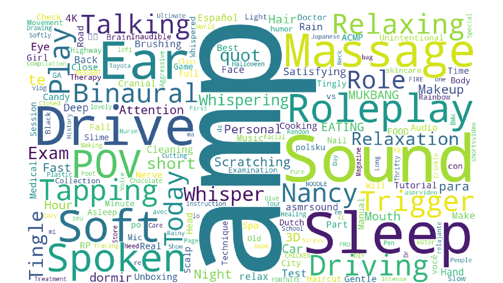](https://htmlpreview.github.io/?https://github.com/Shaadalam9/ASMR-analysis/blob/main/figures/wordcloud_title.html)  
Word cloud of ASMR video titles, generated from the collected dataset. More frequent terms appear larger, highlighting common themes and patterns in how creators title their ASMR videos.

[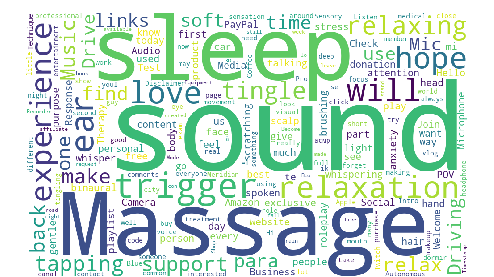](https://htmlpreview.github.io/?https://github.com/Shaadalam9/ASMR-analysis/blob/main/figures/wordcloud_description.html)  
Word cloud of ASMR video descriptions, showing the most frequent terms used in the textual descriptions accompanying ASMR videos. This highlights how creators describe, contextualize, and promote their content.

[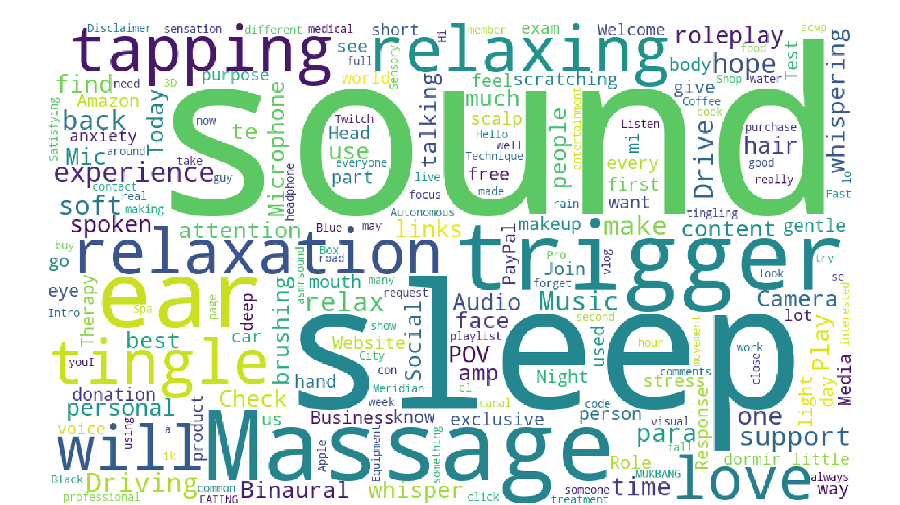](https://htmlpreview.github.io/?https://github.com/Shaadalam9/ASMR-analysis/blob/main/figures/wordcloud_both.html)  
Combined word cloud of ASMR video titles and descriptions, offering a holistic view of the most frequent terms across both fields. The visualization summarizes the overarching themes and stylistic patterns in the dataset.

---

### Keyword frequencies (spaCy lemmas)

[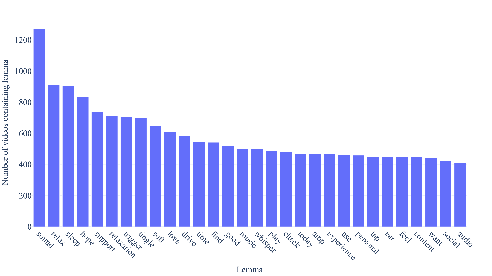](https://htmlpreview.github.io/?https://github.com/Shaadalam9/ASMR-analysis/blob/main/figures/spacy_keywords_both.html)  
Bar chart of the most frequent content lemmas (after stopword removal), computed with spaCy. Each bar shows in how many videos a lemma appears at least once, providing a complementary, more linguistically grounded view to the word clouds.

---

### Duration vs popularity

[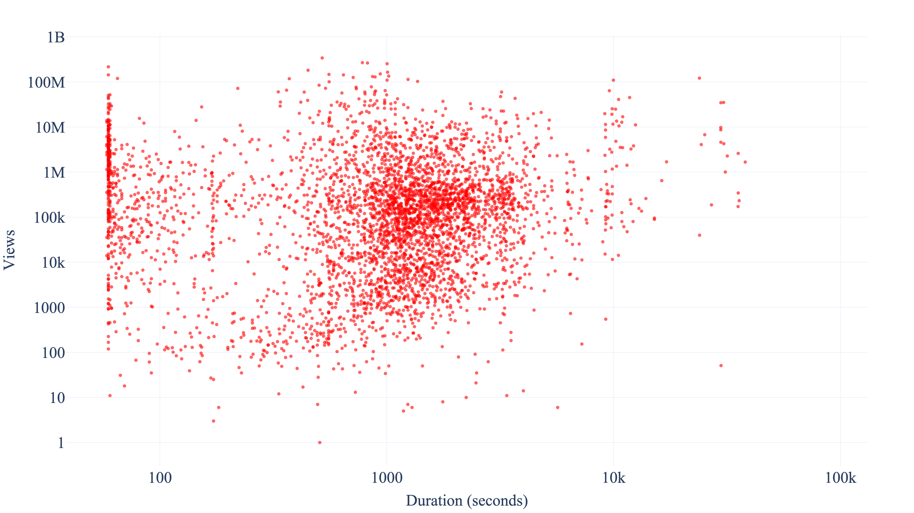](https://htmlpreview.github.io/?https://github.com/Shaadalam9/ASMR-analysis/blob/main/figures/duration_vs_views.html)  
Log–log scatter plot of video duration (in seconds) versus total views. Each point is a video. This figure shows whether longer ASMR videos systematically attract more views or whether extremely short/long videos behave differently from “typical” lengths.

---

### Distribution of popularity (log-normality check)

[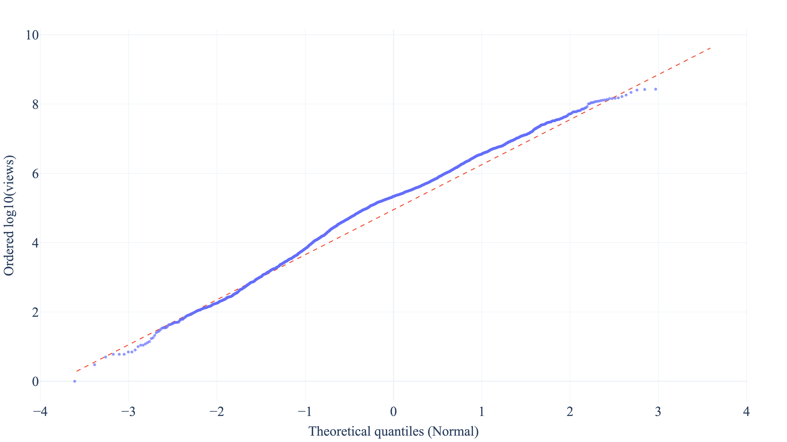](https://htmlpreview.github.io/?https://github.com/Shaadalam9/ASMR-analysis/blob/main/figures/log_views_qq_plot.html)  
Q–Q plot comparing the empirical distribution of \(\log_{10}(\text{views})\) against a theoretical normal distribution. Points close to the dashed line indicate that a log-normal model is a reasonable approximation for view counts; systematic deviations highlight heavy tails or skew.

---

### Language-level differences

[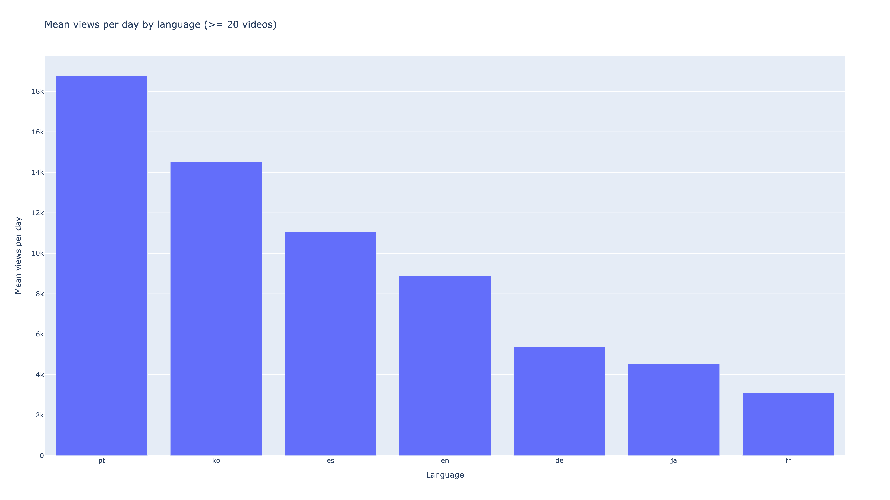](https://htmlpreview.github.io/?https://github.com/Shaadalam9/ASMR-analysis/blob/main/figures/language_mean_views_per_day.html)  
Mean views per day by language (for languages with at least a minimum number of videos). This figure compares growth rates of ASMR content across languages (e.g., English vs Spanish vs others).

[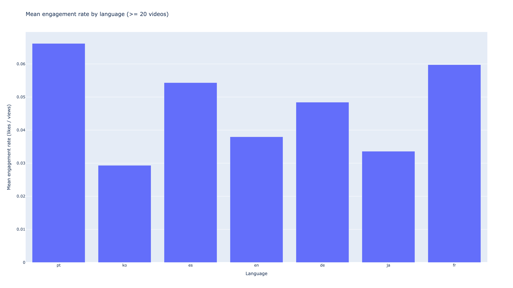](https://htmlpreview.github.io/?https://github.com/Shaadalam9/ASMR-analysis/blob/main/figures/language_mean_engagement_rate.html)  
Mean engagement rate (likes / views) by language, showing which language communities tend to have more engaged ASMR audiences.

---

### Title style and performance

[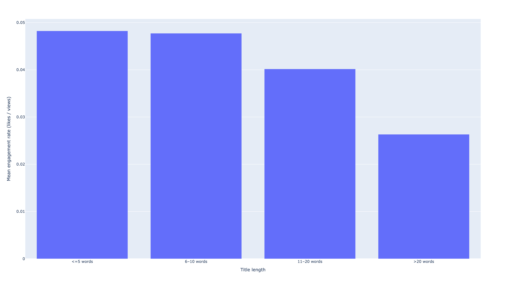](https://htmlpreview.github.io/?https://github.com/Shaadalam9/ASMR-analysis/blob/main/figures/title_length_mean_engagement_rate.html)  
Mean engagement rate by title length bucket (e.g., ≤5 words, 6–10 words, 11–20 words, >20 words). This figure examines whether concise or longer ASMR titles correlate with higher engagement.

[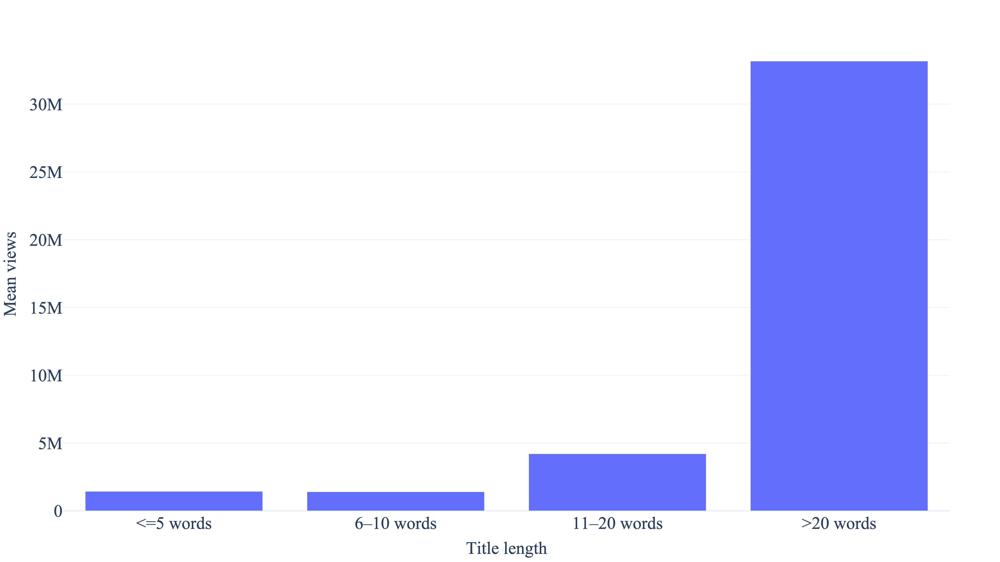](https://htmlpreview.github.io/?https://github.com/Shaadalam9/ASMR-analysis/blob/main/figures/title_length_mean_views.html)  
Mean total views by title length bucket, indicating whether shorter or more descriptive titles are associated with higher popularity.

---

### Themes vs growth (views per day distributions)

[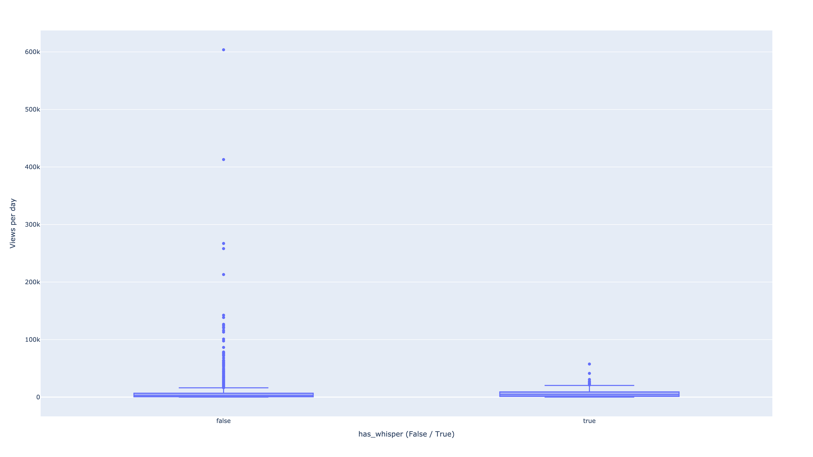](https://htmlpreview.github.io/?https://github.com/Shaadalam9/ASMR-analysis/blob/main/figures/has_whisper_views_per_day_boxplot.html)  
Distribution of views per day for videos with and without “whisper” themes. This boxplot compares growth patterns between whisper-based ASMR and other content.

[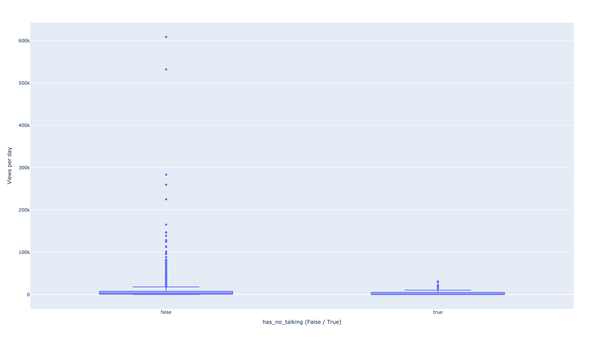](https://htmlpreview.github.io/?https://github.com/Shaadalam9/ASMR-analysis/blob/main/figures/has_no_talking_views_per_day_boxplot.html)  
Distribution of views per day for videos tagged as “no talking” (or similar) versus others. This shows whether no-talking ASMR tends to grow faster or slower than talking-based ASMR.

[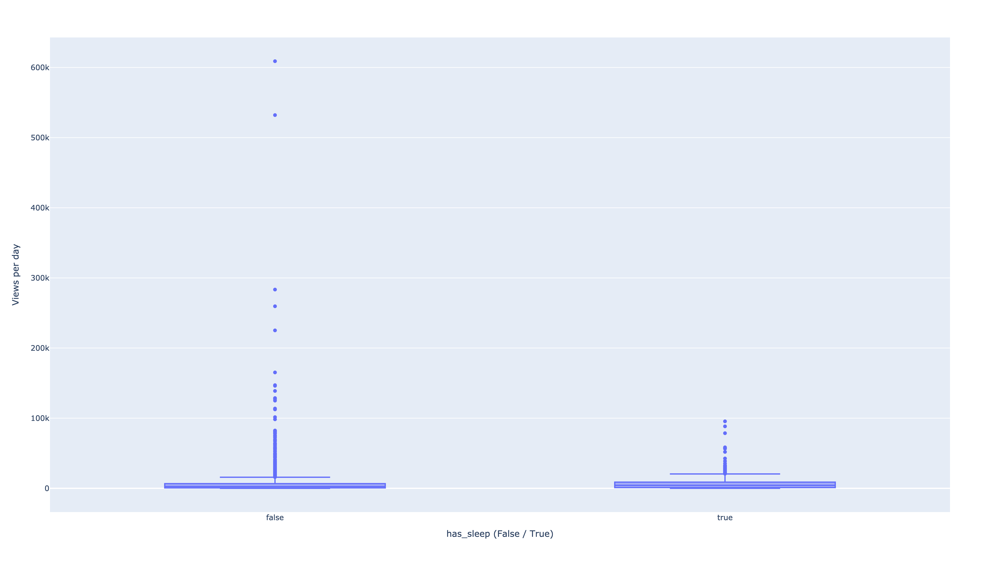](https://htmlpreview.github.io/?https://github.com/Shaadalam9/ASMR-analysis/blob/main/figures/has_sleep_views_per_day_boxplot.html)  
Distribution of views per day for sleep-oriented ASMR videos compared to non-sleep content, capturing whether “for sleep” videos exhibit different growth dynamics.

[](https://htmlpreview.github.io/?https://github.com/Shaadalam9/ASMR-analysis/blob/main/figures/has_binaural_views_per_day_boxplot.html)  
Distribution of views per day for videos mentioning “binaural” or related keywords versus other videos, exploring whether binaural setups are associated with different growth rates.

[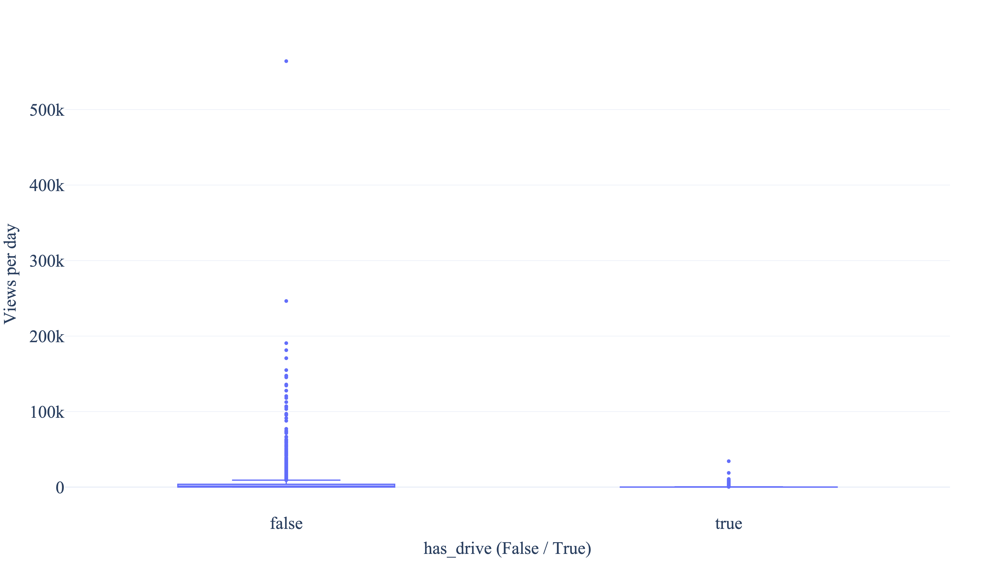](https://htmlpreview.github.io/?https://github.com/Shaadalam9/ASMR-analysis/blob/main/figures/has_drive_views_per_day_boxplot.html)  
Distribution of views per day for “drive” / driving-themed ASMR videos compared to other content. This figure explores whether in-car / driving ASMR behaves differently in terms of growth.

---

### Community growth over time

[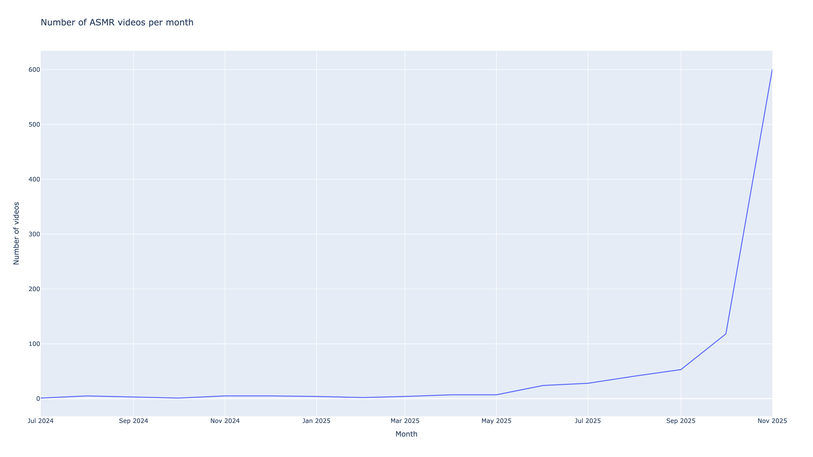](https://htmlpreview.github.io/?https://github.com/Shaadalam9/ASMR-analysis/blob/main/figures/monthly_video_counts.html)  
Time series of the number of ASMR videos uploaded per month in the dataset. This visualizes the growth of the ASMR ecosystem over time.

[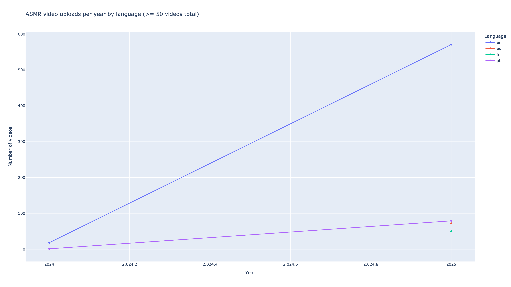](https://htmlpreview.github.io/?https://github.com/Shaadalam9/ASMR-analysis/blob/main/figures/language_growth_over_years.html)  
Yearly counts of ASMR uploads by language (for languages with enough data). This figure compares how quickly different language communities have expanded.

---

### Theme trends over time

[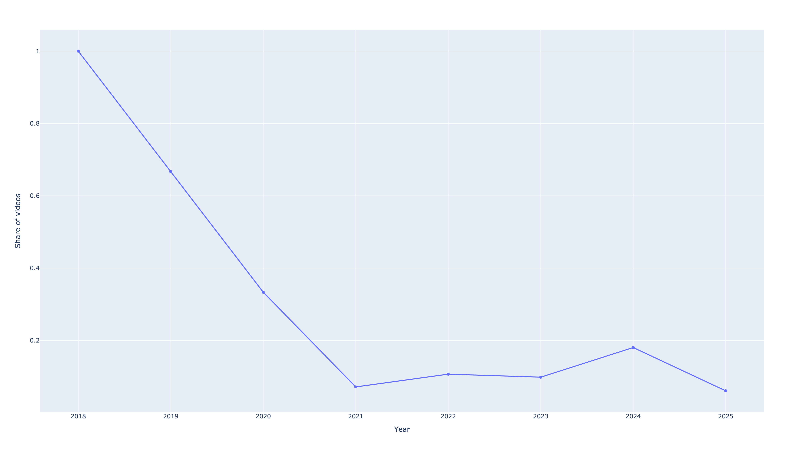](https://htmlpreview.github.io/?https://github.com/Shaadalam9/ASMR-analysis/blob/main/figures/has_no_talking_trend_overall_fig.html)  
Number of videos tagged as “no talking” (or similar) per year, aggregated across all languages. This shows whether no-talking ASMR has become more or less prevalent over time.

[](https://htmlpreview.github.io/?https://github.com/Shaadalam9/ASMR-analysis/blob/main/figures/has_no_talking_trend_by_language_fig.html)  
Number of “no talking” ASMR videos per year, broken down by language. This highlights cross-lingual differences in the adoption of no-talking formats.

[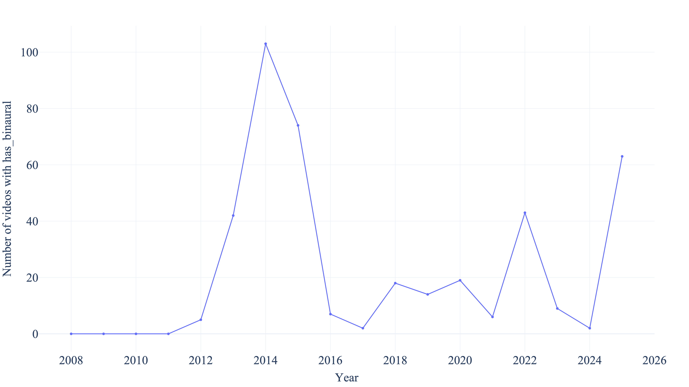](https://htmlpreview.github.io/?https://github.com/Shaadalam9/ASMR-analysis/blob/main/figures/has_binaural_trend_overall_fig.html)  
Number of videos with “binaural” (and related) keywords per year, aggregated across languages. This plot reveals when binaural ASMR started to gain traction and how its prevalence has evolved.

[](https://htmlpreview.github.io/?https://github.com/Shaadalam9/ASMR-analysis/blob/main/figures/has_binaural_trend_by_language_fig.html)  
Number of binaural ASMR videos per year, broken down by language, illustrating how different language communities adopted binaural production techniques.

[](https://htmlpreview.github.io/?https://github.com/Shaadalam9/ASMR-analysis/blob/main/figures/drive_trend_overall_fig.html)  
Number of videos whose text mentions “drive” (lemma-based) per year. This captures the rise (or lack thereof) of driving-themed ASMR content over time.

---

### Clustering of ASMR videos (PCA embedding)

[](https://htmlpreview.github.io/?https://github.com/Shaadalam9/ASMR-analysis/blob/main/figures/cluster_sizes_pca.html)  
Number of videos per cluster, where clusters are derived from title+description text, duration, engagement metrics, and language. This shows how the ASMR corpus is partitioned into natural content groups (PCA-based embedding).

[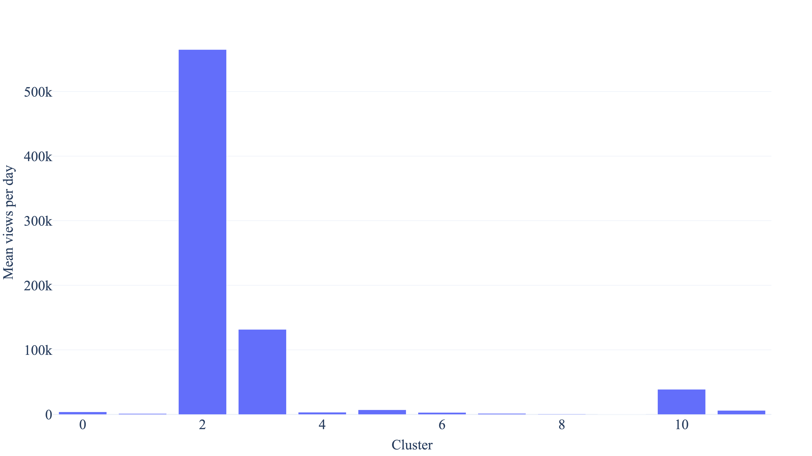](https://htmlpreview.github.io/?https://github.com/Shaadalam9/ASMR-analysis/blob/main/figures/cluster_mean_views_per_day_pca.html)  
Mean views per day for each cluster (PCA-based clustering), comparing typical growth rates across the discovered ASMR content clusters.

[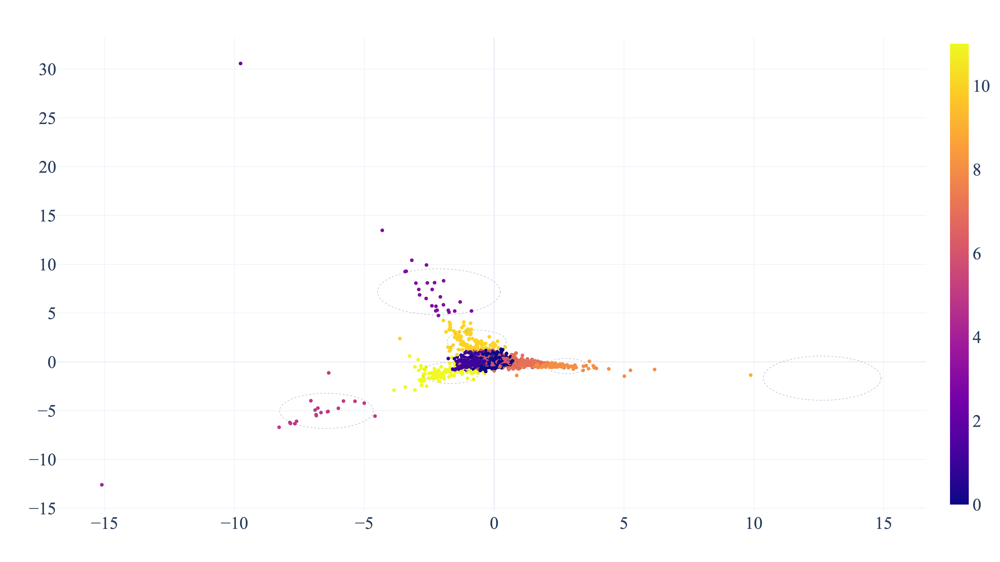](https://htmlpreview.github.io/?https://github.com/Shaadalam9/ASMR-analysis/blob/main/figures/cluster_scatter_embedding_pca.html)  
2D PCA embedding of ASMR videos based on title+description text, duration, engagement metrics, and language, with colors indicating clusters and dotted circles roughly outlining each cluster’s region. This offers an interpretable map of the ASMR content landscape.

---

### Alternative t-SNE embedding of clusters

[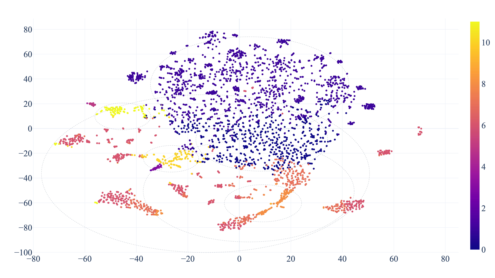](https://htmlpreview.github.io/?https://github.com/Shaadalam9/ASMR-analysis/blob/main/figures/cluster_scatter_embedding_tsne.html)  
2D t-SNE embedding of the same clustered videos, providing an alternative nonlinear view of the ASMR content space. Compared to PCA, t-SNE can highlight tighter local groupings at the cost of less interpretable global geometry.
