## ASMR video analysis

## Getting started
[](https://www.python.org/downloads/release/python-312/)
[](https://docs.astral.sh/uv/)

Tested with **Python 3.12** and the [`uv`](https://docs.astral.sh/uv/) package manager.  
Follow these steps to set up the project.

**Step 1:** Install `uv`. `uv` is a fast Python package and environment manager. Install it using one of the following methods:

**macOS / Linux (bash/zsh):**
```bash
curl -LsSf https://astral.sh/uv/install.sh | sh
```

**Windows (PowerShell):**
```powershell
irm https://astral.sh/uv/install.ps1 | iex
```

**Alternative (if you already have Python and pip):**
```bash
pip install uv
```

**Step 2:** Fix permissions (if needed):t

Sometimes `uv` needs to create a folder under `~/.local/share/uv/python` (macOS/Linux) or `%LOCALAPPDATA%\uv\python` (Windows).  
If this folder was created by another tool (e.g. `sudo`), you may see an error like:
```lua
error: failed to create directory ... Permission denied (os error 13)
```

To fix it, ensure you own the directory:

### macOS / Linux
```bash
mkdir -p ~/.local/share/uv
chown -R "$(id -un)":"$(id -gn)" ~/.local/share/uv
chmod -R u+rwX ~/.local/share/uv
```

### Windows
```powershell
# Create directory if it doesn't exist
New-Item -ItemType Directory -Force "$env:LOCALAPPDATA\uv"

# Ensure you (the current user) own it
# (usually not needed, but if permissions are broken)
icacls "$env:LOCALAPPDATA\uv" /grant "$($env:UserName):(OI)(CI)F"
```

**Step 3:** After installing, verify:
```bash
uv --version
```

**Step 4:** Clone the repository:
```command line
git clone https://github.com/Shaadalam9/ASMR-analysis
cd multiped
```

**Step 5:** Ensure correct Python version. If you don’t already have Python 3.12 installed, let `uv` fetch it:
```command line
uv python install 3.12
```
The repo should contain a .python-version file so `uv` will automatically use this version.

**Step 6:** Create and sync the virtual environment. This will create **.venv** in the project folder and install dependencies exactly as locked in **uv.lock**:
```command line
uv sync --frozen
```

**Step 7:** Activate the virtual environment:

**macOS / Linux (bash/zsh):**
```bash
source .venv/bin/activate
```

**Windows (PowerShell):**
```powershell
.\.venv\Scripts\Activate.ps1
```

**Windows (cmd.exe):**
```bat
.\.venv\Scripts\activate.bat
```

**Step 8:** Ensure that dataset are present. Place required datasets (including **mapping.csv**) into the **data/** directory:


**Step 9:** Run the code:
```command line
python3 analysis.py
```

### Configuration of project

Configuration of the project needs to be defined in `config`. Please use the `default.config` file for the required structure of the file. If no custom config file is provided, `default.config` is used.

The config file has the following parameters:

- **`data`**  
  Path to the directory containing the project’s data files (e.g., `data`).

- **`query`**  
  The search query string used to discover videos (e.g., `"ASMR"`, `"ASMR roleplay"`, etc.).

- **`analysis_text_source`**  
  Controls which textual fields are used in text-based analyses and visualisations.  
  Valid values:
  - `"title"` – use video titles only  
  - `"description"` – use video descriptions only  
  - `"both"` – use titles and descriptions concatenated (default)

- **`date_before`**  
  Optional upper bound on video upload date in ISO format (`YYYY-MM-DD`).  
  When set, only videos uploaded *on or before* this date are included.  
  If left as the placeholder string `"YYYY-MM-DD"`, it is treated as unset.

- **`date_after`**  
  Optional lower bound on video upload date in ISO format (`YYYY-MM-DD`).  
  When set, only videos uploaded *on or after* this date are included.  
  If left as the placeholder string `"YYYY-MM-DD"`, it is treated as unset.

- **`date_window_months`**  
  Size (in months) of the relative time window used when explicit `date_before` / `date_after` bounds are not provided. This is used by the collection/analysis pipeline to restrict the dataset to a recent window instead of the full historical range.

- **`font_family`**  
  Font family used in figures (e.g., Plotly and Matplotlib outputs), such as `"Libertine"`.

- **`font_size`**  
  Base font size used in figures (axis labels, titles, legends, etc.).

- **`plotly_template`**  
  Name of the Plotly template to use for all interactive figures (e.g., `"plotly_white"`).

- **`logger_level`**  
  Verbosity level of console logging. Valid values are:
  - `"debug"`
  - `"info"`
  - `"warning"`
  - `"error"`


## Results

### Word clouds

[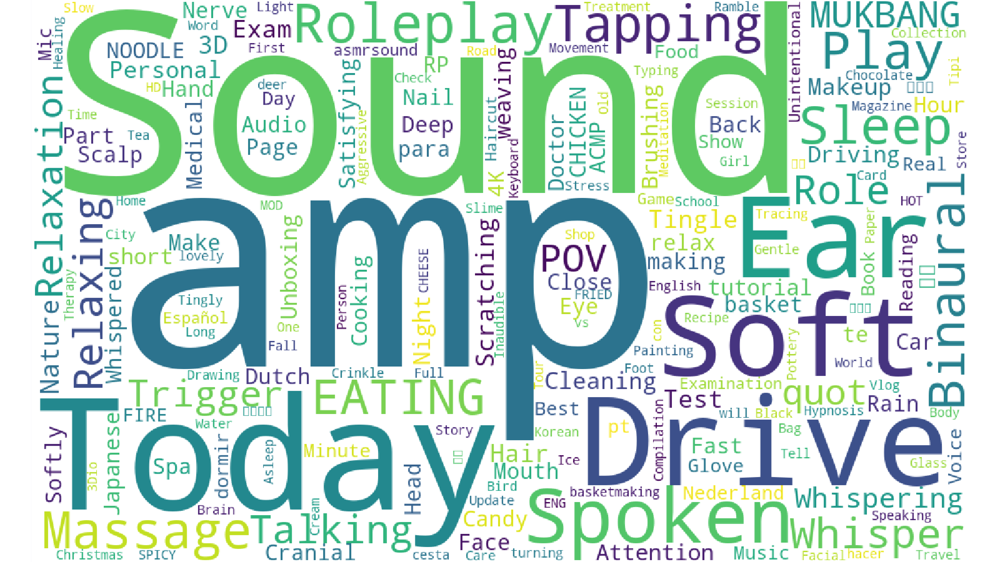](https://htmlpreview.github.io/?https://github.com/Shaadalam9/ASMR-analysis/blob/main/figures/wordcloud_title.html)  
Word cloud generated from ASMR video **titles** only. Larger terms reflect words frequently used in video naming, revealing common framing strategies, thematic cues, and stylistic conventions.

[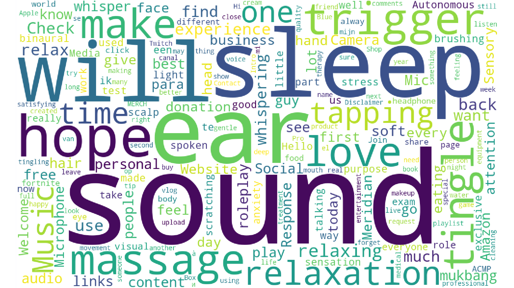](https://htmlpreview.github.io/?https://github.com/Shaadalam9/ASMR-analysis/blob/main/figures/wordcloud_description.html)  
Word cloud derived from **descriptions** only. This highlights how creators contextualize their videos, promote content, and articulate use-cases such as sleep support, relaxation, or role-play scenarios.

[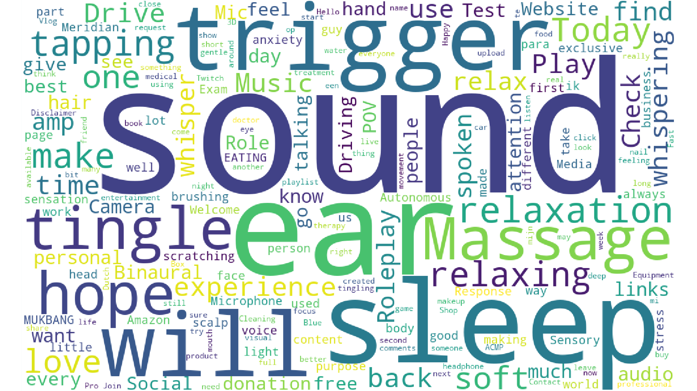](https://htmlpreview.github.io/?https://github.com/Shaadalam9/ASMR-analysis/blob/main/figures/wordcloud_both.html)  
Combined word cloud using **titles and descriptions together**, providing a holistic overview of the most frequent vocabulary across both fields and summarizing overarching themes in creator communication.

---

### Verb-only word clouds (spaCy lemmas)

[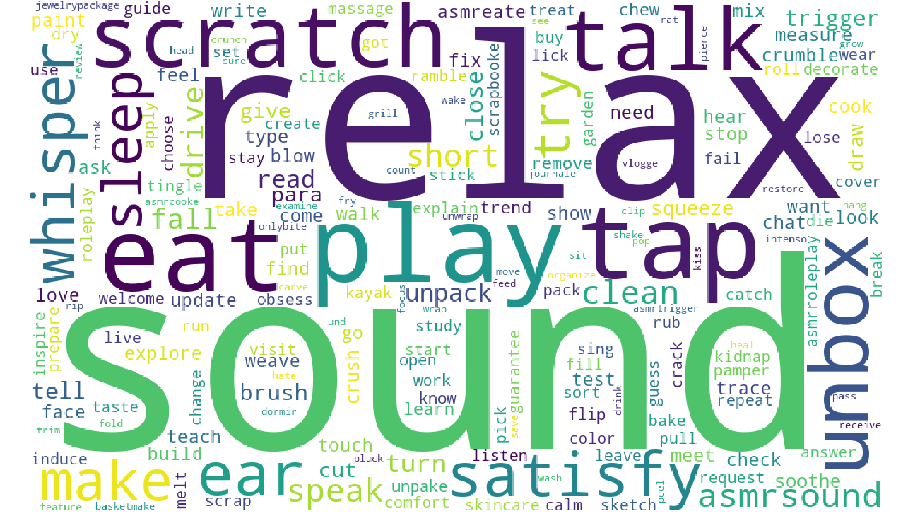](https://htmlpreview.github.io/?https://github.com/Shaadalam9/ASMR-analysis/blob/main/figures/wordcloud_verbs_title.html)  
Verb-only word cloud extracted from **titles**, where each verb lemma is counted at most once per video. This isolates action words used in ASMR titles (e.g., whisper, tap, brush, sleep).

[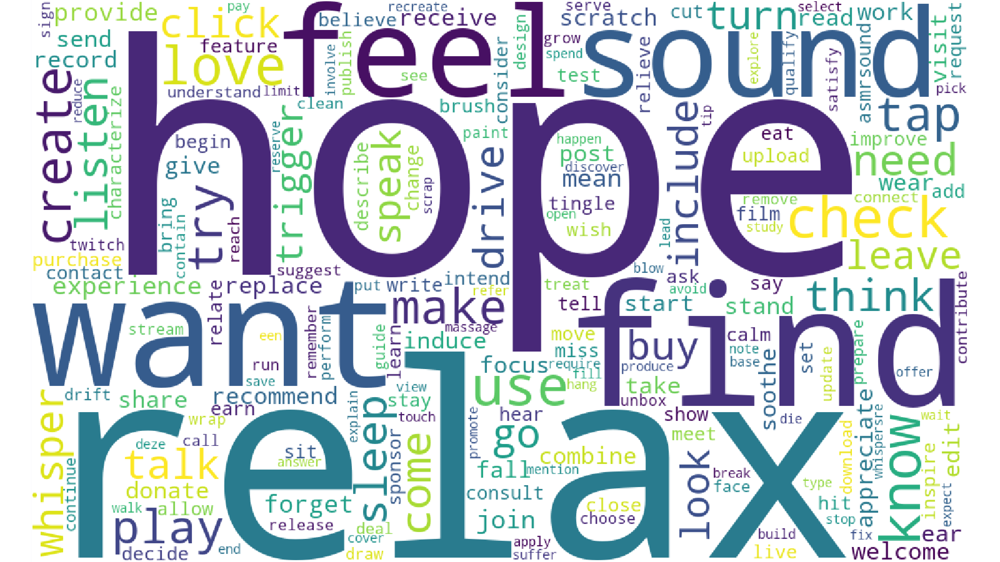](https://htmlpreview.github.io/?https://github.com/Shaadalam9/ASMR-analysis/blob/main/figures/wordcloud_verbs_description.html)  
Verb-only word cloud extracted from **descriptions**. This highlights the actions described by creators when explaining their videos, such as brushing, guiding, helping, or tapping.

[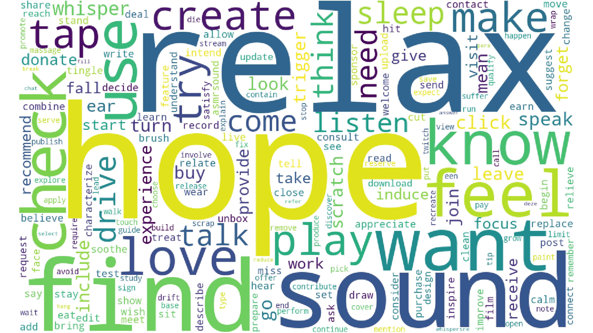](https://htmlpreview.github.io/?https://github.com/Shaadalam9/ASMR-analysis/blob/main/figures/wordcloud_verbs_both.html)  
Verb-only cloud using **titles and descriptions combined**, emphasizing recurring ASMR actions across the entire dataset. This captures the behavioural and trigger-oriented vocabulary that defines ASMR production.


### Keyword frequencies (spaCy lemmas)

[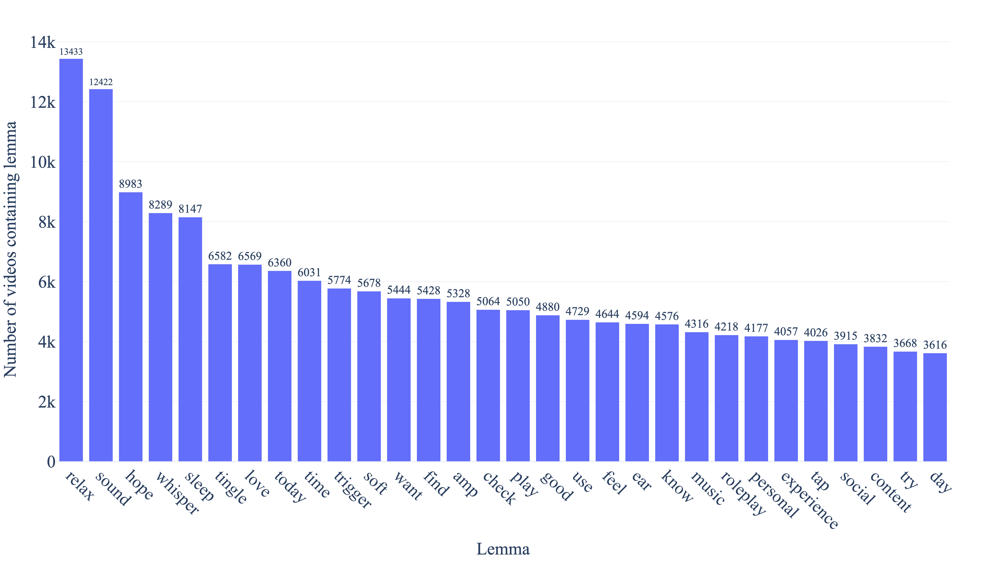](https://htmlpreview.github.io/?https://github.com/Shaadalam9/ASMR-analysis/blob/main/figures/spacy_keywords_both.html)  
Bar chart of the most frequent content lemmas (after stopword removal), computed with spaCy. Each bar shows in how many videos a lemma appears at least once, providing a complementary, more linguistically grounded view to the word clouds.

---

### Duration vs popularity

[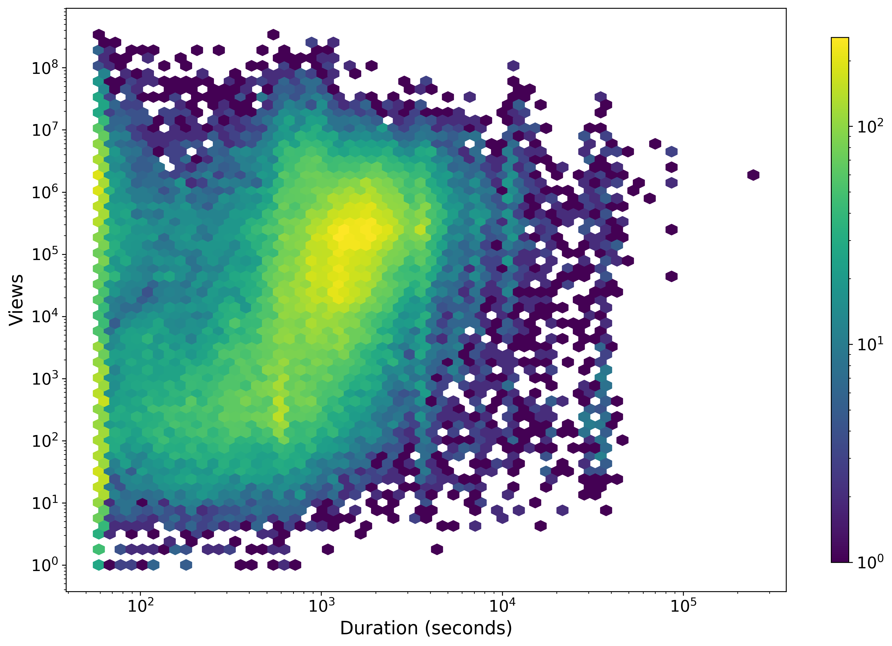](https://htmlpreview.github.io/?https://github.com/Shaadalam9/ASMR-analysis/blob/main/figures/duration_vs_views.html)  
Log–log scatter plot of video duration (in seconds) versus total views. Each point is a video. This figure shows whether longer ASMR videos systematically attract more views or whether extremely short/long videos behave differently from “typical” lengths.

---

### Distribution of popularity (log-normality check)

[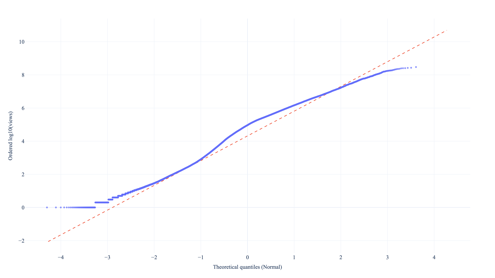](https://htmlpreview.github.io/?https://github.com/Shaadalam9/ASMR-analysis/blob/main/figures/log_views_qq_plot.html)  
Q–Q plot comparing the empirical distribution of \(\log_{10}(\text{views})\) against a theoretical normal distribution. Points close to the dashed line indicate that a log-normal model is a reasonable approximation for view counts; systematic deviations highlight heavy tails or skew.

---

### Language-level differences

[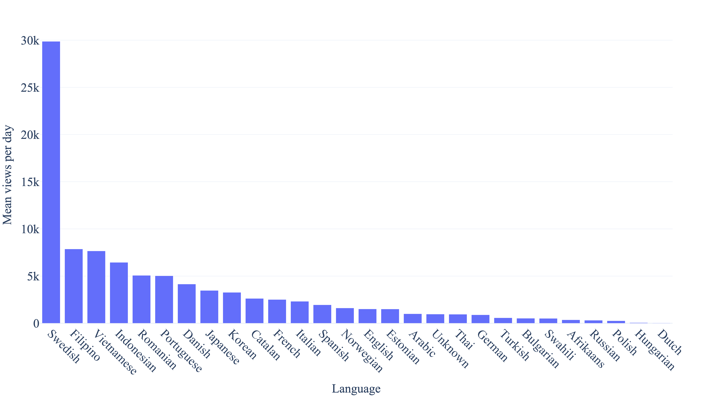](https://htmlpreview.github.io/?https://github.com/Shaadalam9/ASMR-analysis/blob/main/figures/language_mean_views_per_day.html)  
Mean views per day by language (for languages with at least a minimum number of videos). This figure compares growth rates of ASMR content across languages (e.g., English vs Spanish vs others).

[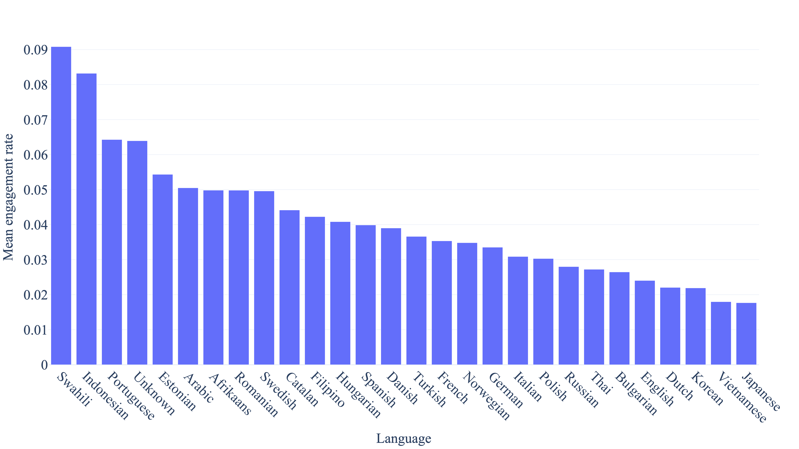](https://htmlpreview.github.io/?https://github.com/Shaadalam9/ASMR-analysis/blob/main/figures/language_mean_engagement_rate.html)  
Mean engagement rate (likes / views) by language, showing which language communities tend to have more engaged ASMR audiences.

---

### Title style and performance

[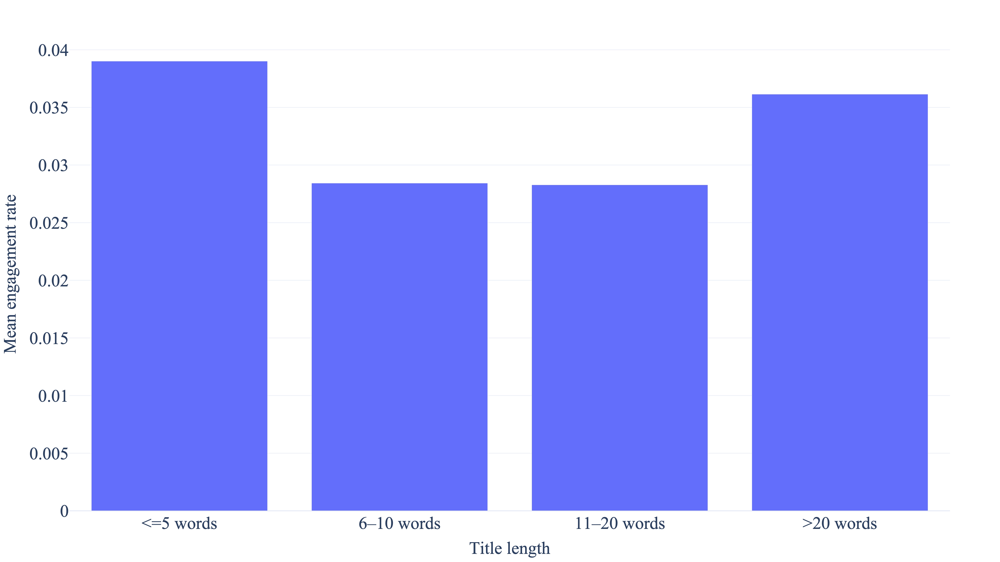](https://htmlpreview.github.io/?https://github.com/Shaadalam9/ASMR-analysis/blob/main/figures/title_length_mean_engagement_rate.html)  
Mean engagement rate by title length bucket (e.g., ≤5 words, 6–10 words, 11–20 words, >20 words). This figure examines whether concise or longer ASMR titles correlate with higher engagement.

[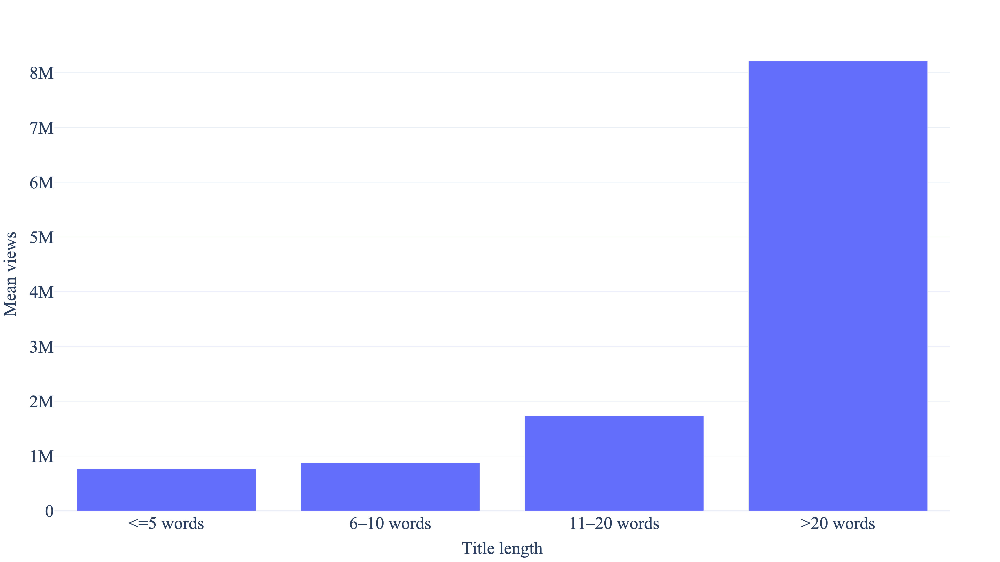](https://htmlpreview.github.io/?https://github.com/Shaadalam9/ASMR-analysis/blob/main/figures/title_length_mean_views.html)  
Mean total views by title length bucket, indicating whether shorter or more descriptive titles are associated with higher popularity.

---

### Themes vs growth (views per day distributions)

[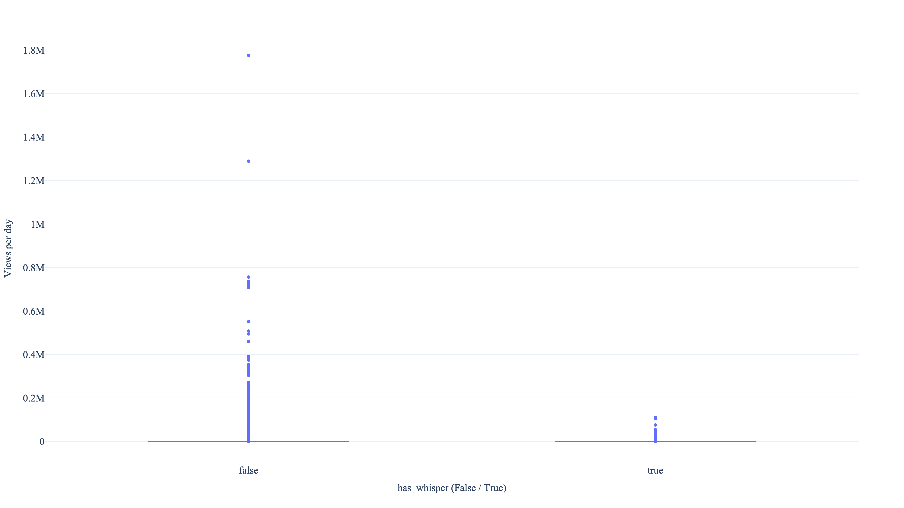](https://htmlpreview.github.io/?https://github.com/Shaadalam9/ASMR-analysis/blob/main/figures/has_whisper_views_per_day_boxplot.html)  
Distribution of views per day for videos with and without “whisper” themes. This boxplot compares growth patterns between whisper-based ASMR and other content.

[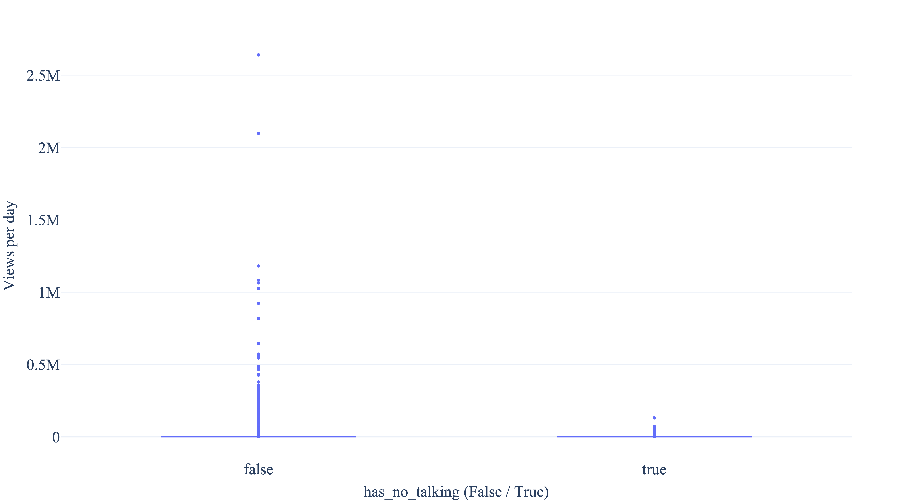](https://htmlpreview.github.io/?https://github.com/Shaadalam9/ASMR-analysis/blob/main/figures/has_no_talking_views_per_day_boxplot.html)  
Distribution of views per day for videos tagged as “no talking” (or similar) versus others. This shows whether no-talking ASMR tends to grow faster or slower than talking-based ASMR.

[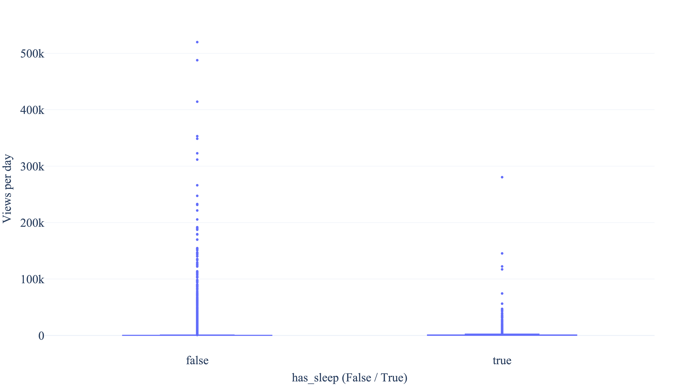](https://htmlpreview.github.io/?https://github.com/Shaadalam9/ASMR-analysis/blob/main/figures/has_sleep_views_per_day_boxplot.html)  
Distribution of views per day for sleep-oriented ASMR videos compared to non-sleep content, capturing whether “for sleep” videos exhibit different growth dynamics.

[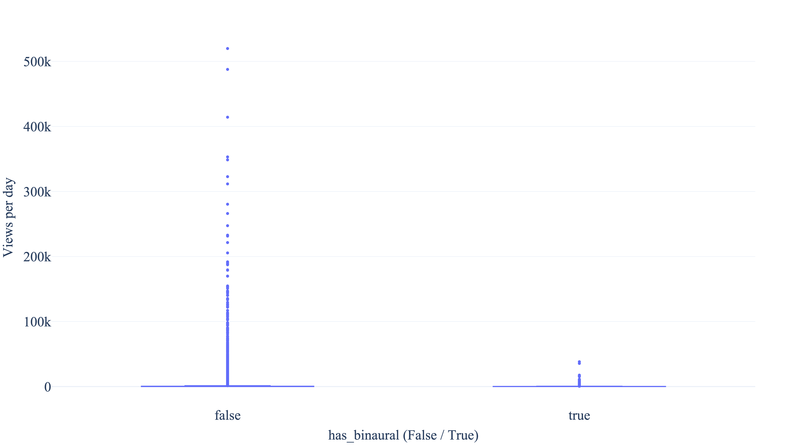](https://htmlpreview.github.io/?https://github.com/Shaadalam9/ASMR-analysis/blob/main/figures/has_binaural_views_per_day_boxplot.html)  
Distribution of views per day for videos mentioning “binaural” or related keywords versus other videos, exploring whether binaural setups are associated with different growth rates.

[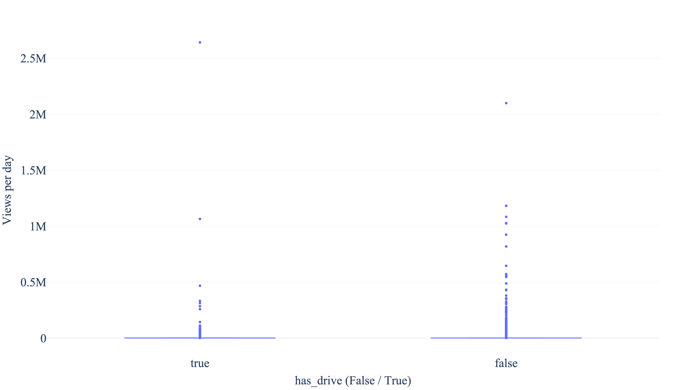](https://htmlpreview.github.io/?https://github.com/Shaadalam9/ASMR-analysis/blob/main/figures/has_drive_views_per_day_boxplot.html)  
Distribution of views per day for “drive” / driving-themed ASMR videos compared to other content. This figure explores whether in-car / driving ASMR behaves differently in terms of growth.

---

### Community growth over time

[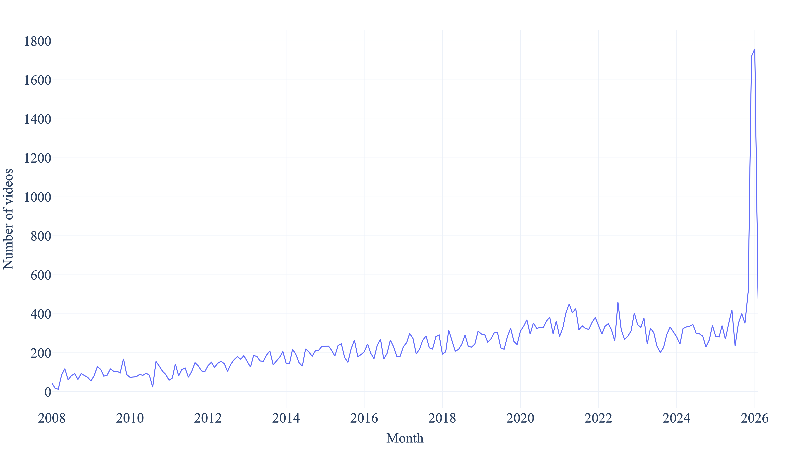](https://htmlpreview.github.io/?https://github.com/Shaadalam9/ASMR-analysis/blob/main/figures/monthly_video_counts.html)  
Time series of the number of ASMR videos uploaded per month in the dataset. This visualizes the growth of the ASMR ecosystem over time.

[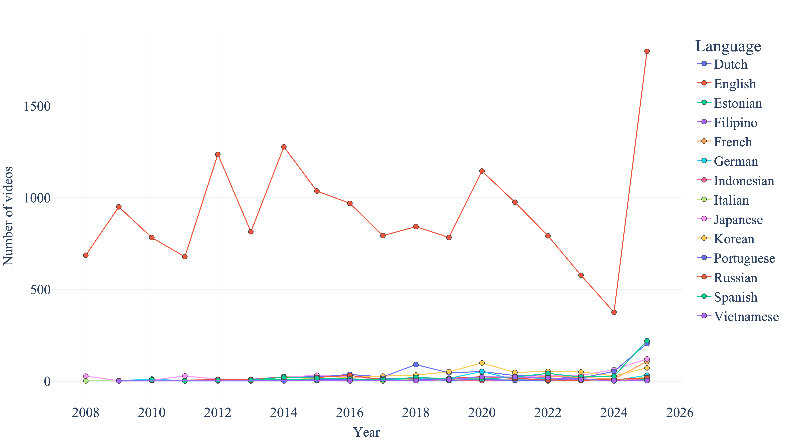](https://htmlpreview.github.io/?https://github.com/Shaadalam9/ASMR-analysis/blob/main/figures/language_growth_over_years.html)  
Yearly counts of ASMR uploads by language (for languages with enough data). This figure compares how quickly different language communities have expanded.

---

### Theme trends over time

[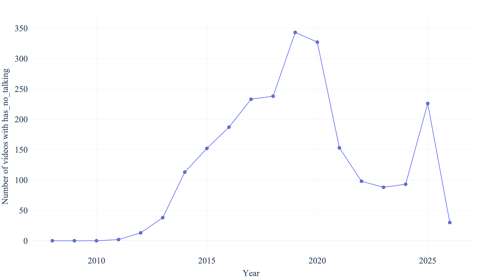](https://htmlpreview.github.io/?https://github.com/Shaadalam9/ASMR-analysis/blob/main/figures/has_no_talking_trend_overall_fig.html)  
Number of videos tagged as “no talking” (or similar) per year, aggregated across all languages. This shows whether no-talking ASMR has become more or less prevalent over time.


[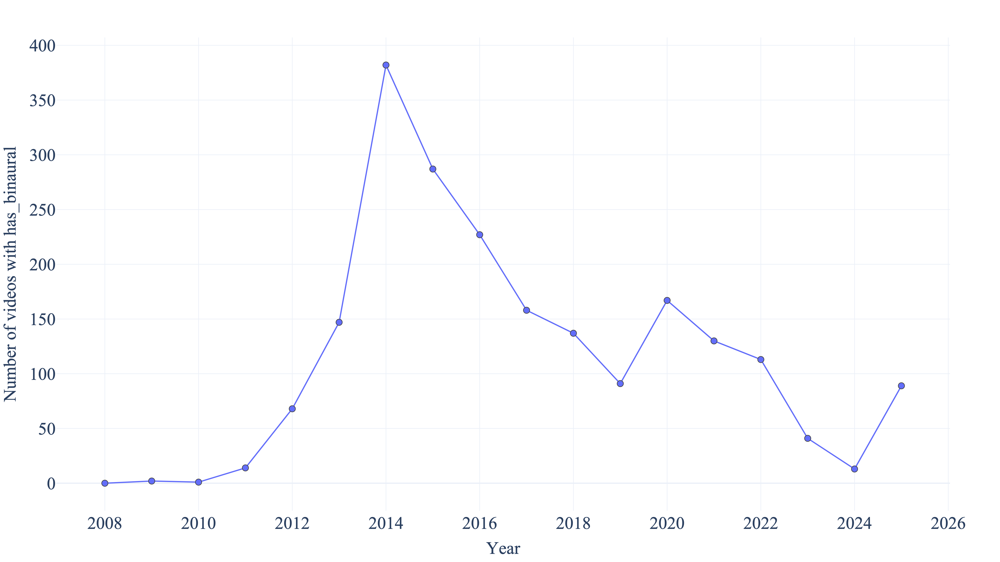](https://htmlpreview.github.io/?https://github.com/Shaadalam9/ASMR-analysis/blob/main/figures/has_binaural_trend_overall_fig.html)  
Number of videos with “binaural” (and related) keywords per year, aggregated across languages. This plot reveals when binaural ASMR started to gain traction and how its prevalence has evolved.


[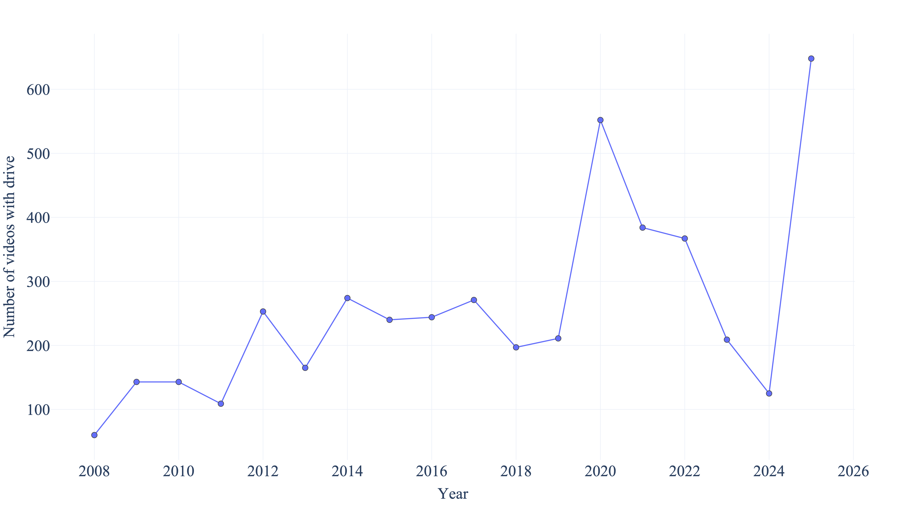](https://htmlpreview.github.io/?https://github.com/Shaadalam9/ASMR-analysis/blob/main/figures/drive_trend_overall_fig.html)  
Visualisation of the yearly count of ASMR videos whose title or description includes the lemma “drive” (e.g., driving / road-trip role-plays).

---

### Choosing the number of clusters (elbow method)

[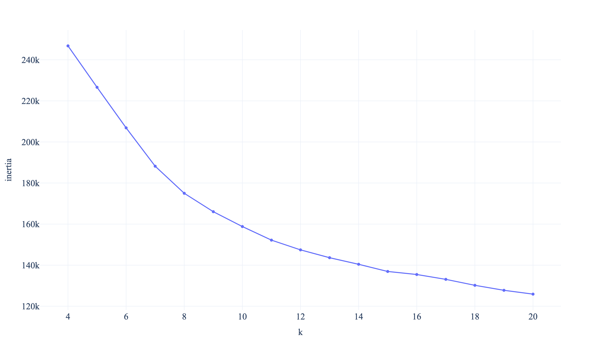](https://htmlpreview.github.io/?https://github.com/Shaadalam9/ASMR-analysis/blob/main/figures/kmeans_elbow_both.html)  
Elbow plot of K-means inertia (within-cluster sum of squared errors) for \(k\) from 4 to 20, using title+description text, duration, engagement metrics, and language features. The curve shows diminishing returns in inertia reduction beyond about \(k = 11\), which we therefore select as the final number of clusters.

---

### Clustering of ASMR videos (PCA embedding)

[](https://htmlpreview.github.io/?https://github.com/Shaadalam9/ASMR-analysis/blob/main/figures/cluster_sizes_pca.html)  
Number of videos per cluster, where clusters are derived from title+description text, duration, engagement metrics, and language. This shows how the ASMR corpus is partitioned into natural content groups (PCA-based embedding).

[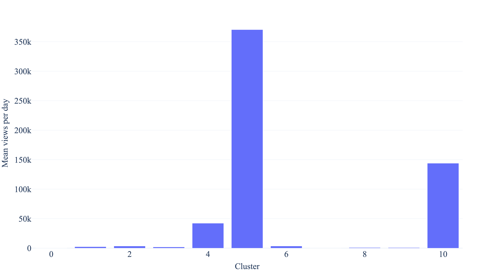](https://htmlpreview.github.io/?https://github.com/Shaadalam9/ASMR-analysis/blob/main/figures/cluster_mean_views_per_day_pca.html)  
Mean views per day for each cluster (PCA-based clustering), comparing typical growth rates across the discovered ASMR content clusters.

[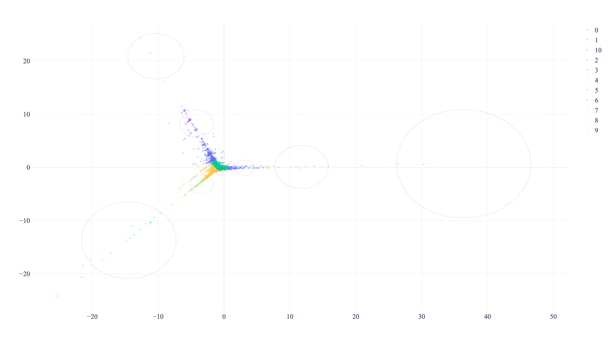](https://htmlpreview.github.io/?https://github.com/Shaadalam9/ASMR-analysis/blob/main/figures/cluster_scatter_embedding_pca.html)  
2D PCA embedding of ASMR videos based on title+description text, duration, engagement metrics, and language, with colors indicating clusters and dotted circles roughly outlining each cluster’s region. This offers an interpretable map of the ASMR content landscape.

---

### Alternative t-SNE embedding of clusters

[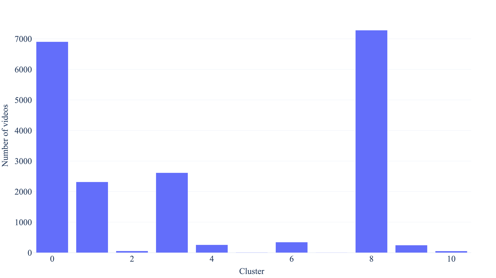](https://htmlpreview.github.io/?https://github.com/Shaadalam9/ASMR-analysis/blob/main/figures/cluster_sizes_tsne.html)  
Number of videos per cluster when using the same K-means solution but visualised with a t-SNE-based embedding. This summarises how large each content cluster is under the t-SNE variant.

[](https://htmlpreview.github.io/?https://github.com/Shaadalam9/ASMR-analysis/blob/main/figures/cluster_mean_views_per_day_tsne.html)  
Mean views per day for each cluster under the t-SNE embedding, highlighting which content clusters tend to grow faster or slower, independent of the specific 2D embedding used for visualisation.

[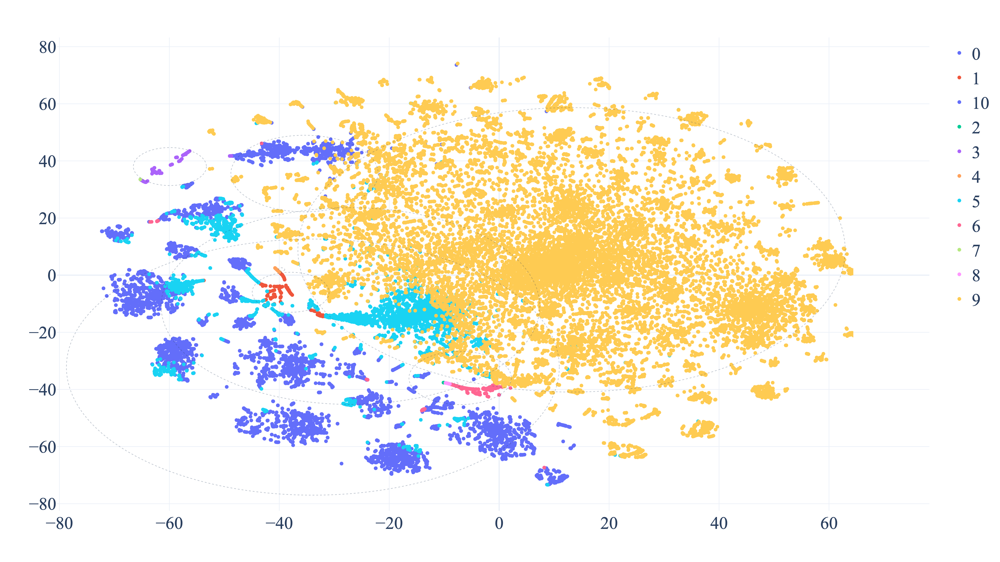](https://htmlpreview.github.io/?https://github.com/Shaadalam9/ASMR-analysis/blob/main/figures/cluster_scatter_embedding_tsne.html)  
2D t-SNE embedding of the same clustered videos, providing an alternative nonlinear view of the ASMR content space. Compared to PCA, t-SNE can highlight tighter local groupings at the cost of less interpretable global geometry.

---

### Research-style t-SNE embedding with cluster ellipses

[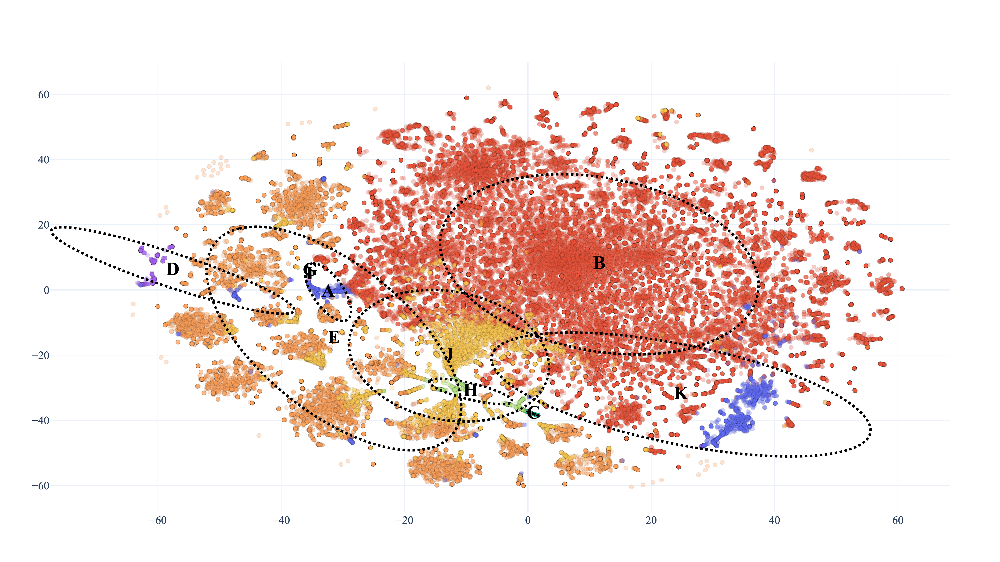](https://htmlpreview.github.io/?https://github.com/Shaadalam9/ASMR-analysis/blob/main/figures/cluster_tsne_research_tsne_research.html)  
Research-style 2D t-SNE embedding of ASMR videos with clusters indicated by coloured points and dotted ellipse contours. Cluster labels mark approximate centroids, making it easier to inspect how languages, themes, and growth patterns align with different regions of the ASMR content space.
