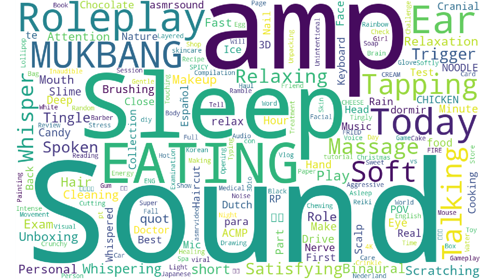
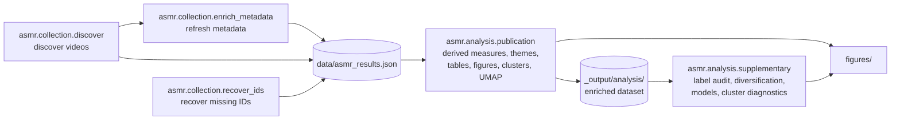
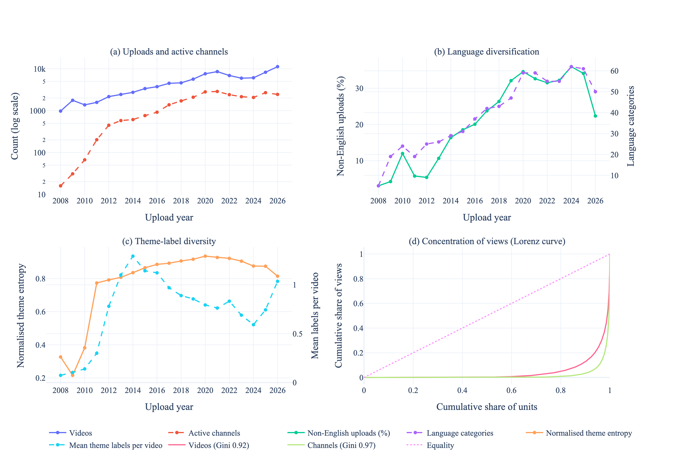
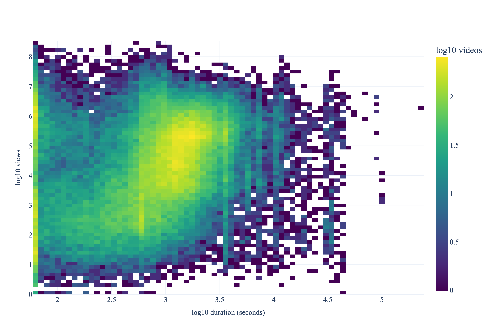
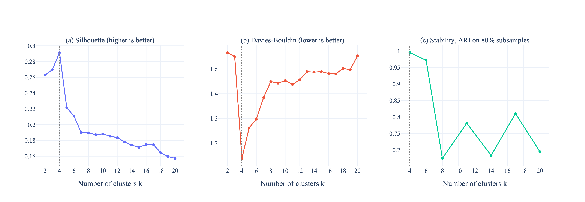
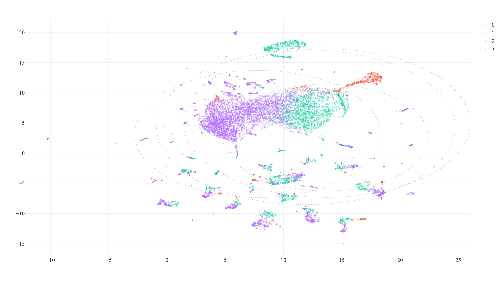
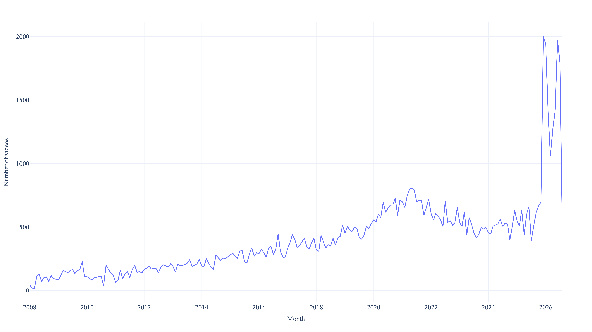
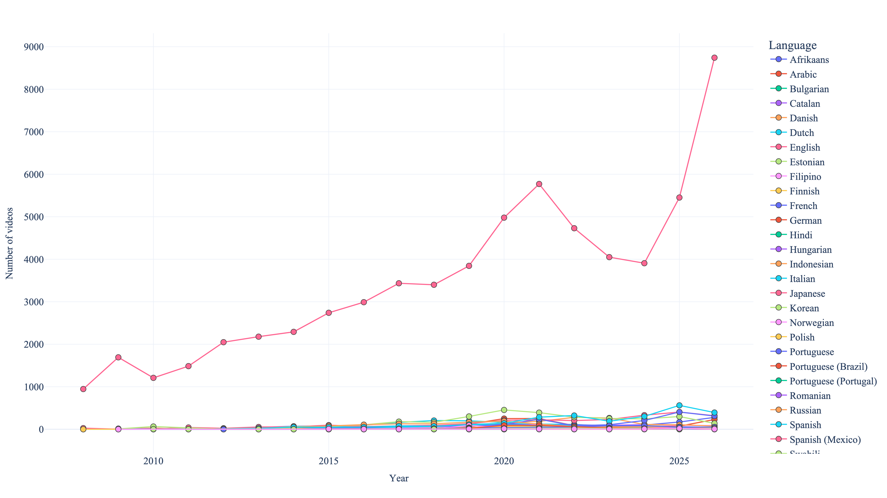

# ASMR on YouTube: a multilingual, longitudinal analysis

Code for collecting, enriching and analysing metadata of explicitly labelled ASMR videos on YouTube, and for reproducing the figures, tables and supplementary analyses of:

> Alam, M. S., and Bazilinskyy, P. (2026). *Nineteen years of ASMR on YouTube: A multilingual, theme-level analysis of 90,189 videos*. Manuscript in preparation.

This is a descriptive platform-metadata study. It describes what is produced and how attention is distributed. It does not measure viewers, sleep quality, wellbeing, subjective ASMR experiences, or causal effects.

[](https://htmlpreview.github.io/?https://github.com/Shaadalam9/ASMR-analysis/blob/main/figures/wordcloud_title.html)

## What we did

1. **Collected** 90,189 videos whose titles contain "ASMR", uploaded between 1 January 2008 and 31 August 2026 (18,126 channels, 81 language categories), using the YouTube Data API in three-month windows plus `pytubefix` search as a supplementary route.
2. **Enriched** the records with duration, views, likes, upload date, language labels, title-style features and ten rule-based textual theme labels.
3. **Described** the corpus: language, duration, engagement, themes, and monthly growth.
4. **Asked four research questions** about genre formation, concentration of attention, format and attention, and the robustness of the text labels (see below).
5. **Audited** the labels and clustering for sensitivity to language, text field, scaling and the number of clusters.



## Main findings

All numbers come from the deposited snapshot and the fixed reference date of 1 September 2026.

**The genre broadened and diversified.** Active channels grew from 285 (2008 to 2011) to 8,248 (2020 to 2023). The share of uploads from the most prolific 1% of channels fell from 83.9% to 18.9%. The non-English share rose from 6.3% to about one third, and the normalised entropy of theme labels rose from 0.65 to 0.93, also when computed for English videos only.

[](https://htmlpreview.github.io/?https://github.com/Shaadalam9/ASMR-analysis/blob/main/figures/ecosystem_diversification.html)

**Attention is extremely concentrated.** The Gini coefficient of views across videos is 0.92. The top 1% of videos hold 49.4% of all views, and the top 1% of channels hold 67.3%. The median video gets 21.9 views per day against a mean of 1,038.

[](https://htmlpreview.github.io/?https://github.com/Shaadalam9/ASMR-analysis/blob/main/figures/duration_vs_views.html)

**Means mislead.** Videos under 10 minutes have the highest mean views per day (1,853) but the lowest median (1.2). Pooled comparisons confound format with creator: within the same channel, videos over 180 minutes have about 130% more views per day than 10 to 30 minute videos, role-play and ear-focused labels go with about 31% and 35% more, and the penalty for short videos disappears.

**Text labels are language dependent.** The English-lexical rules find at least one theme in 54.5% of English videos but only 35.7% of non-English videos. The most common theme depends on whether descriptions are searched (sleep for full text, role play for titles). Extending two rules to ten other languages more than doubles their prevalence among non-English videos without changing their growth profile.

**Cluster structure is weak.** After log-scaling the numeric inputs, k-means is best at k = 4 (silhouette 0.29, Davies-Bouldin 1.14, resampling ARI 0.995). The clusters separate mainly by attention regime and duration, not by subgenre.

[](https://htmlpreview.github.io/?https://github.com/Shaadalam9/ASMR-analysis/blob/main/figures/kmeans_k_diagnostics.html)

[](https://htmlpreview.github.io/?https://github.com/Shaadalam9/ASMR-analysis/blob/main/figures/cluster_scatter_embedding_umap.html)

**More figures.**

| Monthly uploads | Language growth over the years |
| --- | --- |
| [](https://htmlpreview.github.io/?https://github.com/Shaadalam9/ASMR-analysis/blob/main/figures/monthly_video_counts.html) | [](https://htmlpreview.github.io/?https://github.com/Shaadalam9/ASMR-analysis/blob/main/figures/language_growth_over_years.html) |

Every PNG in this README links to an interactive HTML version of the same figure (hover, zoom and filter). Further interactive figures are in [`figures/`](figures/): theme trends, per-theme growth boxplots, language engagement, title length, and the Q-Q plot of log views. The UMAP shown here is a downsampled interactive version, and the full 90,189-point static map is `figures/cluster_umap_full_static_umap_full.png`.

> The links use [htmlpreview.github.io](https://htmlpreview.github.io/) to render the HTML files stored in this repository. If you prefer, enable GitHub Pages for the repository and replace the prefix of the links, or download the HTML files and open them in a browser. Plotly.js is loaded from a CDN, so an internet connection is needed.

## Repository structure

```text
asmr/                           Python package (run modules with `python -m ...`)
  settings.py                   Paths, configuration and secrets
  logger.py, logging_config.py  Logging helpers
  collection/
    discover.py                 Windowed video discovery and initial metadata collection
    enrich_metadata.py          Optional refresh of existing metadata and video statistics
    recover_ids.py              Recovery of identifiers missing from the main JSON file
  processing/
    preprocessing.py            Derived measures, title features, language normalisation, theme labels
    keywords.py                 Keyword and lemma analysis, word-cloud pipelines
    text_tools.py               Stopwords and text normalisation helpers
  analysis/
    publication.py              Publication pipeline: measures, tables, figures, clustering, UMAP
    summaries.py                Descriptive summary tables and temporal counts
    clustering.py               Shared TF-IDF preprocessor, k-means, PCA and UMAP
    supplementary/              Supplementary analyses (one module per stage)
      measurement.py            Theme-label audit
      ecosystem.py              Diversification and concentration of attention
      models.py                 Multivariable models with year and channel fixed effects
      cluster_diagnostics.py    Cluster-number diagnostics and stability
      statistics.py             Gini, shares, entropy and HHI
      shared.py                 Paths, data loading and figure/table export
  visualization/
    figures.py                  Plotly figure generation and export
    summary_figures.py          Summary and trend figures
paper/                          Manuscript sources (LaTeX): main.tex and the double-anonymous Internet Research version
tests/                          Deterministic unit tests that do not require YouTube access
figures/                        Generated figures (HTML, PNG, EPS); all figures are made with Plotly
default.config                  Versioned publication defaults
pyproject.toml, uv.lock         Dependencies and lint configuration
```

## Manuscript

The manuscript sources are in [`paper/`](paper/). `paper/main.tex` follows the section structure of the authors' earlier papers: Introduction (with the aim of the study), Method, Results, Discussion (with limitations and future work, and conclusions), supplementary material and declarations, and appendices for the additional figures and tables. `paper/make_internet_research.py` derives the double-anonymous Internet Research version from `main.tex` into `paper/submission/` (`main.tex`, a bibliography without the authors' own papers, and the figures: structured abstract, no author details or links, Harvard citations, Roman-numeral tables). The script stops if any identifying text is left. Build either version with `latexmk -pdf main.tex` in its folder. The figures are the EPS exports in `paper/figures/`, copied from `figures/`.

## Reproducibility safeguards

* `analysis_reference_date` is fixed to `2026-09-01T00:00:00Z`, so views per day and likes per day do not change simply because the analysis is rerun later.
* Theme detection defaults to the deterministic rule-based method. It does not change according to whether a local spaCy model is installed.
* `force_recompute` defaults to `true`, so stale pickle files cannot silently determine results.
* Randomised algorithms and word cloud layouts use the configured seed of 42.
* Clustering uses log10-scaled duration, engagement rate and views per day. Missing numeric values are median imputed inside the fitted pipeline, and missingness is not used as a feature.
* Normality diagnostics are written to `_output/analysis/normality_tests.csv`.
* Every analysis run writes `_output/analysis/reproducibility_manifest.json` with the input data SHA256 digest, record count, settings, Python version, and package versions.
* Local configuration, credentials, raw data, caches, and generated output are excluded from version control.
* The collection code redacts API keys from logged search errors, rotates keys on quota errors (HTTP 429), and stops early when both the Data API and `pytubefix` are unavailable instead of looping through empty windows.

## Requirements

* Python 3.12
* [`uv`](https://docs.astral.sh/uv/)

Install `uv`, clone the repository, and create the locked environment:

```bash
git clone https://github.com/Shaadalam9/ASMR-analysis.git
cd ASMR-analysis
uv sync --frozen
cp default.config config
```

The repository contains `.python-version`, `pyproject.toml`, and `uv.lock`. The frozen installation should therefore use the same dependency resolution as the publication release.

## Data

The code archive does not contain API credentials or the research dataset. Place the deposited dataset at:

```text
data/asmr_results.json
```

The expected structure is a JSON object keyed by YouTube video identifier:

```json
{
  "VIDEO_ID": {
    "title": "Example ASMR title",
    "description": "Example description",
    "duration": 1200,
    "channelId": "CHANNEL_ID",
    "author": "Channel name",
    "views": 100000,
    "likes": 4000,
    "uploadDate": "2020-01-01T12:00:00Z",
    "language": "en",
    "languageSource": null,
    "channel_average_views": 85000.0,
    "metadataCollectedAt": null
  }
}
```

For exact reproduction of the paper, use the deposited 90,189 video snapshot rather than recollecting current YouTube values. The snapshot used for the current manuscript has SHA256 digest `b1a25ec911d05fbcea923e74bf66b33cda03be3bf8088ae79b3a08516395ca41` (also written to `_output/analysis/reproducibility_manifest.json` on every run). YouTube statistics and availability change over time.

## Configuration

The versioned defaults in `default.config` reproduce the publication settings. The current configuration loader expects a local `config` file containing the complete set of configuration keys. For a reproducible local run, copy `default.config` to `config` and change only values that must differ locally, such as the dataset directory.

| Setting | Publication value | Meaning |
| --- | --- | --- |
| `data` | `data` | Directory containing `asmr_results.json` |
| `query` | `ASMR` | Search term and required title substring |
| `analysis_text_source` | `both` | Use concatenated titles and descriptions |
| `date_before` | `null` | Optional collection upper date bound |
| `date_after` | `null` | Optional collection lower date bound |
| `date_window_months` | `3` | YouTube API search window size |
| `analysis_reference_date` | `2026-09-01T00:00:00Z` | Fixed denominator date for daily rates |
| `theme_detection_mode` | `rule_based` | Deterministic textual theme method |
| `theme_rule_version` | `1.0.0` | Version recorded in output and caches |
| `force_recompute` | `true` | Rebuild publication outputs instead of trusting caches |
| `refresh_existing_statistics` | `false` | Preserve deposited values unless an explicit refresh is requested |
| `random_seed` | `42` | Seed for clustering and sampling |
| `clustering_n_clusters` | `4` | K used for the reported exploratory solution, chosen with the diagnostics from `python -m asmr.analysis.supplementary cluster` |
| `auto_open_plots` | `false` | Do not open browser windows during batch runs |

Create the local configuration from the versioned defaults:

```bash
cp default.config config
```

Then edit only the values that need to differ locally. For example, change the `data` entry in `config` to the directory containing the deposited dataset while leaving the publication analysis settings unchanged.

## Credentials

Credentials must never be committed or included in a shared ZIP file. For collection or metadata refresh, set one of these environment variables:

```bash
export YOUTUBE_API_KEY="your_key"
```

or, for key rotation:

```bash
export YOUTUBE_API_KEYS="key_one,key_two"
```

The scripts retain backwards compatibility with an ignored local `secret` JSON file, but environment variables are recommended.

## Reproduce the publication analysis

With the deposited JSON snapshot in `data/asmr_results.json`, run:

```bash
uv run python -m asmr.analysis.publication
```

The main machine readable outputs are written to `_output/analysis/`. Publication copies of figures are also written to `figures/`.

The supplementary analyses reported in the manuscript (theme-label audit, diversification and concentration measures, multivariable models, and cluster-number diagnostics) are produced from the enriched dataset written by `asmr.analysis.publication`, so run that first:

```bash
uv run python -m asmr.analysis.supplementary            # all stages
uv run python -m asmr.analysis.supplementary models     # or: measurement, ecosystem, models, models_title_only, cluster
```

Outputs are written to `_output/analysis/extra/` and `figures/`. The `cluster` stage fits k means for k = 2 to 20 and takes about ten to twenty minutes.

Important outputs include:

* `reproducibility_manifest.json`
* `asmr_videos_enriched.csv`
* `duration_stats.csv`
* `language_stats.csv`
* `title_style_stats.csv`
* `theme_flag_counts.csv`
* `normality_tests.csv`
* theme trend tables
* cluster summaries and full UMAP coordinates

Run the deterministic tests with:

```bash
uv run python -m unittest discover -s tests -v
```

## Collect a new dataset

Set valid date bounds in a local `config` file and provide a YouTube API key. Then run:

```bash
uv run python -m asmr.collection.discover
```

The API branch partitions the configured period into consecutive three month windows. The `pytubefix` branch uses YouTube search relevance ordering and is therefore a supplementary discovery route rather than a guarantee of complete platform coverage.

A record is retained when:

* its title contains the configured query as a case insensitive substring;
* it is a standard video result;
* its known duration is at least 59 seconds;
* it passes the configured upload date bounds; and
* its video identifier is not already present.

Search results are not a census of all YouTube content. API limits, ranking, removed videos, private videos, missing fields, and platform changes affect recall.

## Create or refresh a metadata snapshot

Do not run `asmr.collection.enrich_metadata`, `asmr.collection.discover`, or `asmr.collection.recover_ids` when reproducing the publication analysis from the deposited snapshot. These scripts can change the corpus or its metadata. For exact reproduction, run only the tests and `asmr.analysis.publication`.

To preserve deposited values, `refresh_existing_statistics` is `false` by default. To deliberately refresh views and likes for all existing records, create a local override:

```json
{
  "refresh_existing_statistics": true
}
```

Then run:

```bash
uv run python -m asmr.collection.enrich_metadata
```

Archive the resulting JSON once the refresh finishes and report the actual retrieval period. A refresh performed after publication will not reproduce the original numerical results because YouTube metrics change continuously.

## Implemented measures

For video \(v\), with the fixed reference date used to calculate age:

```text
views_per_day(v) = views(v) / days_since_upload(v)
likes_per_day(v) = likes(v) / days_since_upload(v)
engagement_rate(v) = likes(v) / views(v)
```

Engagement is missing when views are zero or missing. Group means are calculated over the videos with a valid value for the relevant measure.

Duration groups are:

* under 10 minutes
* 10 to under 30 minutes
* 30 to under 60 minutes
* 60 to under 180 minutes
* 180 minutes or longer
* unknown

## Language labels

The collection code uses the following order:

1. YouTube `defaultAudioLanguage`
2. YouTube `defaultLanguage`
3. deterministic `langdetect` prediction from the concatenated title and description

The selected source is stored in `languageSource` when available. The deposited 90,189 record publication snapshot retains the language labels but not their record level source field; the reproducibility manifest therefore reports the source as `unknown`. Language detection from short, mixed language, or creator supplied text can be inaccurate and should be interpreted as metadata level classification.
Known code aliases are normalised to shared display names. Unrecognised nonempty codes are preserved rather than being merged with genuinely missing language values.

## Theme labels

The reported themes are Boolean textual indicators derived from lowercased titles and descriptions. The default rules match English lexical forms for:

* whisper
* no talking
* sleep
* binaural or spatial audio
* role play
* ear focused content
* mukbang or eating
* keyboard or typing
* visual triggers
* driving

These are not manually verified audiovisual content categories. The dataset is multilingual, but the reported theme rules are primarily English lexical rules. Consequently, prevalence can be underestimated for creators who use equivalent labels only in other languages. The exact regular expressions are versioned in `utils/preprocessing.py`.

The optional `spacy` mode is retained for exploratory work. It is not the publication default and fails explicitly if the requested model is unavailable.

## Exploratory clustering

The clustering input combines:

* up to 5,000 TF IDF title and description unigram and bigram features, with minimum document frequency 5;
* log10-transformed and standardised duration, engagement rate, and views per day (rates are floored at 1e-4, and non-positive durations are treated as missing);
* one hot encoded language labels.

Before scaling, missing values in the three numeric clustering features are median imputed using statistics fitted on the clustering input. Missingness indicators are not included in the feature space, so clusters are not formed merely because a metric is unavailable. This prevents missing engagement, growth, or duration values from being treated as genuine zeros.

K means uses \(k=4\) (selected using silhouette, Davies Bouldin, and resampling stability diagnostics; see `python -m asmr.analysis.supplementary cluster`), seed 42, and ten initialisations. The numeric inputs are log transformed because raw duration, engagement, and views per day are heavy tailed and otherwise let a handful of extreme videos define whole clusters. UMAP is a visual projection of the fitted feature space, not a definitive taxonomy of ASMR subgenres. The two dimensional UMAP uses 50 TruncatedSVD components, 30 neighbours, minimum distance 0.1, cosine distance, and seed 42.

## Supplementary analyses (`asmr.analysis.supplementary`)

Run after `asmr.analysis.publication`. Each stage writes CSV tables to `_output/analysis/extra/`.

| Stage | Question | Main outputs |
| --- | --- | --- |
| `measurement` | How sensitive are the theme labels to text field and language? | `theme_title_vs_full_text.csv`, `theme_detection_english_vs_non_english.csv`, `theme_multilingual_lexicon_sensitivity.csv`, `theme_validation_sample_to_annotate.csv` |
| `ecosystem` | How did supply diversify and how concentrated is attention? | `ecosystem_by_year.csv`, `ecosystem_by_period.csv`, `channel_entrants_by_year.csv`, figure `ecosystem_diversification` |
| `models` | How do duration, themes, language and title style relate to views per day and engagement, with year and channel fixed effects? | `model_coefficients.csv`, `model_block_r2.csv` |
| `models_title_only` | Do the model results hold when themes are defined from titles only? | `model_coefficients_title_only_themes.csv` |
| `cluster` | Which number of clusters is supported, and how stable is it? | `kmeans_k_diagnostics.csv`, `kmeans_per_cluster_silhouette.csv`, figure `kmeans_k_diagnostics` |

`theme_validation_sample_to_annotate.csv` holds 20 flagged and 20 unflagged videos per theme for manual annotation. No manual precision or recall figure is reported yet.

## Licence

The code is released under the MIT Licence. The YouTube data remain subject to the terms and policies applicable to their source and repository deposition.
