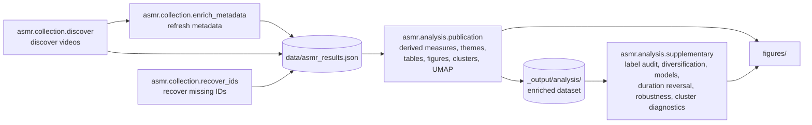

# ASMR on YouTube: a multilingual, longitudinal analysis

Code for collecting, enriching and analysing metadata of explicitly labelled ASMR videos on YouTube, and for reproducing the figures, tables and supplementary analyses of:

> Alam, M. S., and Bazilinskyy, P. (2026). *Nineteen years of ASMR on YouTube: A multilingual, theme-level analysis of 90,189 videos*. Manuscript in preparation.

This is a descriptive platform-metadata study. It describes what is produced and how attention is distributed. It does not measure viewers, sleep quality, wellbeing, subjective ASMR experiences, or causal effects.

[](https://htmlpreview.github.io/?https://github.com/Shaadalam9/ASMR-analysis/blob/main/figures/wordcloud_title.html)

## What we did

1. **Collected** 90,189 videos whose titles contain "ASMR", uploaded between 1 January 2008 and 31 August 2026 (18,126 channels, 81 language categories), using the YouTube Data API in three-month windows plus `pytubefix` search as a supplementary route.
2. **Enriched** the records with duration, views, likes, upload date, language labels, title-style features and ten rule-based textual theme labels.
3. **Described** the corpus: language, duration, engagement, themes and monthly growth.
4. **Measured** how supply diversified over time and how concentrated attention is (Gini coefficients, top shares, Herfindahl-Hirschman index, entropy).
5. **Compared** how duration, themes, language and title style relate to views per day and engagement, with pooled models, models with upload-year fixed effects, and models with channel fixed effects, and checked those results in subsets of the corpus.
6. **Audited** the text labels and the clustering for sensitivity to language, text field, scaling and the number of clusters.


```mermaid
flowchart LR
    A[asmr.collection.discover<br/>discover videos] --> B[asmr.collection.enrich_metadata<br/>refresh metadata]
    B --> C[(data/asmr_results.json)]
    A --> C
    R[asmr.collection.recover_ids<br/>recover missing IDs] --> C
    C --> D[asmr.analysis.publication<br/>derived measures, themes,<br/>tables, figures, clusters, UMAP]
    D --> E[(_output/analysis/<br/>enriched dataset)]
    E --> F[asmr.analysis.supplementary<br/>label audit, diversification, models,<br/>duration reversal, robustness, cluster diagnostics]
    D --> G[figures/]
    F --> G
```

## Main findings

All numbers come from the deposited snapshot and the fixed reference date of 1 September 2026. The figures behind each finding are in the [figure gallery](#figure-gallery).

**The genre broadened and diversified.** Active channels grew from 285 (2008 to 2011) to 8,248 (2020 to 2023). The share of uploads from the most prolific 1% of channels fell from 83.9% to 18.9%. The non-English share rose from 6.3% to about one third, and the normalised entropy of theme labels rose from 0.65 to 0.93, also when computed for English videos only (`ecosystem_diversification`).

**Attention is extremely concentrated.** The Gini coefficient of views across videos is 0.92. The top 1% of videos hold 49.4% of all views, and the top 1% of channels hold 67.3%. The median video gets 21.9 views per day against a mean of 1,038 (`ecosystem_diversification`, `duration_vs_views`).

**Means mislead.** Videos under 10 minutes have the highest mean views per day (1,853) but the lowest median (1.2), a mean-to-median ratio of about 1,600 (`duration_reversal`, panel a). The ranking of themes also changes between means and medians.

**Pooled comparisons confound format with creator.** In a pooled model, videos under 10 minutes have about 76% fewer views per day than 10 to 30 minute videos. Within the same channel the difference is small (about 5% in the full sample), and videos over 180 minutes have about 130% more views per day. The same pattern holds on the videos and channels used by the within-channel model (`duration_reversal`, panel b).

**The within-channel advantage of longer videos is stable.** It is present for English and non-English videos, in all three upload periods, and after excluding the channels with the most views or uploads. The within-channel result for short videos is less stable and varies between about -29% and +12% across subsets (`duration_robustness`).

**Text labels are language dependent.** The English-lexical rules find at least one theme in 54.5% of English videos but only 35.7% of non-English videos. The most common theme depends on whether descriptions are searched (sleep for full text, role play for titles). Extending two rules to ten other languages more than doubles their prevalence among non-English videos without changing their growth profile.

**Cluster structure is weak.** After log-scaling the numeric inputs, k-means is best at k = 4 (silhouette 0.29, Davies-Bouldin 1.14, resampling ARI 0.995). The clusters separate mainly by attention regime and duration, not by subgenre (`kmeans_k_diagnostics`, `cluster_umap_full_static_umap_full`).

## Figure gallery

Every figure is made with Plotly and written to [`figures/`](figures/) as interactive HTML, PNG and EPS (the full static UMAP is PNG and EPS only). Click an image to open the interactive version. The links use [htmlpreview.github.io](https://htmlpreview.github.io/) to render the HTML files stored in this repository. If you prefer, enable GitHub Pages for the repository and replace the prefix of the links, or download the HTML files and open them in a browser. Plotly.js is loaded from a CDN, so an internet connection is needed.

### Corpus overview

| Figure | What it shows |
| --- | --- |
| <a href="https://htmlpreview.github.io/?https://github.com/Shaadalam9/ASMR-analysis/blob/main/figures/wordcloud_title.html"></a> | The 200 most frequent words in the titles of all videos after stopword removal and text cleaning. Font size is proportional to corpus frequency. |
| <a href="https://htmlpreview.github.io/?https://github.com/Shaadalam9/ASMR-analysis/blob/main/figures/wordcloud_description.html"></a> | The same for video descriptions. |
| <a href="https://htmlpreview.github.io/?https://github.com/Shaadalam9/ASMR-analysis/blob/main/figures/wordcloud_both.html"></a> | The same for the concatenation of title and description, which is the text used for the theme labels and clustering. |
| <a href="https://htmlpreview.github.io/?https://github.com/Shaadalam9/ASMR-analysis/blob/main/figures/monthly_video_counts.html"></a> | Number of videos uploaded per month. The most recent months are thinly sampled because newly uploaded videos are retrieved less completely. |
| <a href="https://htmlpreview.github.io/?https://github.com/Shaadalam9/ASMR-analysis/blob/main/figures/duration_vs_views.html"></a> | Log-log density heatmap (70 by 70 bins) of video duration against cumulative views. Colour is the logarithm of the number of videos in a cell. The heatmap shows the heavy tail of views and the mass of videos around 10 to 30 minutes. A faster, zoomable version is [duration_vs_views_interactive.html](https://htmlpreview.github.io/?https://github.com/Shaadalam9/ASMR-analysis/blob/main/figures/duration_vs_views_interactive.html). |
| <a href="https://htmlpreview.github.io/?https://github.com/Shaadalam9/ASMR-analysis/blob/main/figures/log_views_qq_plot.html"></a> | Quantile-quantile plot of log10 views against the normal distribution. The departures in both tails show that even the logarithm of views is not normally distributed. |

### Supply and concentration of attention

| Figure | What it shows |
| --- | --- |
| <a href="https://htmlpreview.github.io/?https://github.com/Shaadalam9/ASMR-analysis/blob/main/figures/ecosystem_diversification.html"></a> | Four panels. (a) Uploads and active channels per year (log scale). (b) Non-English share of uploads and number of language categories. (c) Normalised theme entropy and mean number of theme labels per video. (d) Lorenz curves of cumulative views across videos and channels with Gini coefficients. Together they show supply diversifying while attention stays concentrated. |

### Language and title style

| Figure | What it shows |
| --- | --- |
| <a href="https://htmlpreview.github.io/?https://github.com/Shaadalam9/ASMR-analysis/blob/main/figures/language_growth_over_years.html"></a> | Uploads per year for the larger language categories, showing how non-English ASMR grew. |
| <a href="https://htmlpreview.github.io/?https://github.com/Shaadalam9/ASMR-analysis/blob/main/figures/language_mean_views_per_day.html"></a> | Mean views per day for language categories with at least 20 videos. Very small categories are noisy. |
| <a href="https://htmlpreview.github.io/?https://github.com/Shaadalam9/ASMR-analysis/blob/main/figures/language_mean_engagement_rate.html"></a> | Mean engagement rate (likes divided by views) for language categories with at least 20 videos. |
| <a href="https://htmlpreview.github.io/?https://github.com/Shaadalam9/ASMR-analysis/blob/main/figures/title_length_mean_views.html"></a> | Mean views by title-length bucket (up to 5, 6 to 10, 11 to 20, and over 20 words). |
| <a href="https://htmlpreview.github.io/?https://github.com/Shaadalam9/ASMR-analysis/blob/main/figures/title_length_mean_engagement_rate.html"></a> | Mean engagement rate by the same title-length buckets. |

### Theme labels over time

| Figure | What it shows |
| --- | --- |
| <a href="https://htmlpreview.github.io/?https://github.com/Shaadalam9/ASMR-analysis/blob/main/figures/has_whisper_trend_overall_fig.html"></a> | Number of videos per upload year whose title or description matches the whisper rule. |
| <a href="https://htmlpreview.github.io/?https://github.com/Shaadalam9/ASMR-analysis/blob/main/figures/has_no_talking_trend_overall_fig.html"></a> | Number of videos per upload year whose title or description matches the no talking rule. |
| <a href="https://htmlpreview.github.io/?https://github.com/Shaadalam9/ASMR-analysis/blob/main/figures/has_sleep_trend_overall_fig.html"></a> | Number of videos per upload year whose title or description matches the sleep related rule. |
| <a href="https://htmlpreview.github.io/?https://github.com/Shaadalam9/ASMR-analysis/blob/main/figures/has_binaural_trend_overall_fig.html"></a> | Number of videos per upload year whose title or description matches the binaural / 3d audio rule. |
| <a href="https://htmlpreview.github.io/?https://github.com/Shaadalam9/ASMR-analysis/blob/main/figures/has_roleplay_trend_overall_fig.html"></a> | Number of videos per upload year whose title or description matches the role play rule. |
| <a href="https://htmlpreview.github.io/?https://github.com/Shaadalam9/ASMR-analysis/blob/main/figures/has_ear_cleaning_trend_overall_fig.html"></a> | Number of videos per upload year whose title or description matches the ear cleaning / ear focus rule. |
| <a href="https://htmlpreview.github.io/?https://github.com/Shaadalam9/ASMR-analysis/blob/main/figures/has_mukbang_trend_overall_fig.html"></a> | Number of videos per upload year whose title or description matches the mukbang / eating rule. |
| <a href="https://htmlpreview.github.io/?https://github.com/Shaadalam9/ASMR-analysis/blob/main/figures/has_keyboard_trend_overall_fig.html"></a> | Number of videos per upload year whose title or description matches the keyboard / typing rule. |
| <a href="https://htmlpreview.github.io/?https://github.com/Shaadalam9/ASMR-analysis/blob/main/figures/has_visual_trend_overall_fig.html"></a> | Number of videos per upload year whose title or description matches the visual triggers rule. |
| <a href="https://htmlpreview.github.io/?https://github.com/Shaadalam9/ASMR-analysis/blob/main/figures/has_drive_trend_overall_fig.html"></a> | Number of videos per upload year that match the driving rule. A second copy with the legacy name `drive_trend_overall_fig` is written for compatibility with earlier runs. |

### Theme labels and attention

| Figure | What it shows |
| --- | --- |
| <a href="https://htmlpreview.github.io/?https://github.com/Shaadalam9/ASMR-analysis/blob/main/figures/has_whisper_views_per_day_boxplot.html"></a> | Views per day for videos with and without the whisper label. Box plots show how skewed views per day is within each group; compare medians, not means. |
| <a href="https://htmlpreview.github.io/?https://github.com/Shaadalam9/ASMR-analysis/blob/main/figures/has_no_talking_views_per_day_boxplot.html"></a> | Views per day for videos with and without the no talking label. Box plots show how skewed views per day is within each group; compare medians, not means. |
| <a href="https://htmlpreview.github.io/?https://github.com/Shaadalam9/ASMR-analysis/blob/main/figures/has_sleep_views_per_day_boxplot.html"></a> | Views per day for videos with and without the sleep related label. Box plots show how skewed views per day is within each group; compare medians, not means. |
| <a href="https://htmlpreview.github.io/?https://github.com/Shaadalam9/ASMR-analysis/blob/main/figures/has_binaural_views_per_day_boxplot.html"></a> | Views per day for videos with and without the binaural / 3d audio label. Box plots show how skewed views per day is within each group; compare medians, not means. |
| <a href="https://htmlpreview.github.io/?https://github.com/Shaadalam9/ASMR-analysis/blob/main/figures/has_drive_views_per_day_boxplot.html"></a> | Views per day for videos with and without the driving label. Box plots show how skewed views per day is within each group; compare medians, not means. |

### Format, creators and attention (duration)

| Figure | What it shows |
| --- | --- |
| <a href="https://htmlpreview.github.io/?https://github.com/Shaadalam9/ASMR-analysis/blob/main/figures/duration_reversal.html"></a> | (a) Mean and median views per day by duration bucket on a log scale: short videos have the highest mean and the lowest median. (b) Ratio of views per day relative to 10 to 30 minute videos from three models: pooled on all videos, pooled on the videos used by the within-channel model, and within channel with channel and year fixed effects. Holding the creator constant changes the association. |
| <a href="https://htmlpreview.github.io/?https://github.com/Shaadalam9/ASMR-analysis/blob/main/figures/duration_robustness.html"></a> | The same pooled and within-channel ratios (one panel per duration bucket) in eight subsets: all videos, three upload periods, English and non-English videos, and the corpus without the 1% of channels with the most views or the most uploads. The within-channel advantage of longer videos is present in every subset. The within-channel result for short videos varies by subset. |

### Clusters (exploratory)

| Figure | What it shows |
| --- | --- |
| <a href="https://htmlpreview.github.io/?https://github.com/Shaadalam9/ASMR-analysis/blob/main/figures/kmeans_elbow_both.html"></a> | Inertia against the number of clusters k. Shown for completeness; k was not chosen from the elbow. |
| <a href="https://htmlpreview.github.io/?https://github.com/Shaadalam9/ASMR-analysis/blob/main/figures/kmeans_k_diagnostics.html"></a> | (a) Mean silhouette coefficient, (b) Davies-Bouldin index and (c) stability under 80% subsampling (mean adjusted Rand index) for k = 2 to 20. k = 4 is best on silhouette and Davies-Bouldin and is stable. |
| <a href="https://htmlpreview.github.io/?https://github.com/Shaadalam9/ASMR-analysis/blob/main/figures/cluster_sizes_umap.html"></a> | Number of videos in each of the four clusters. |
| <a href="https://htmlpreview.github.io/?https://github.com/Shaadalam9/ASMR-analysis/blob/main/figures/cluster_mean_views_per_day_umap.html"></a> | Mean views per day in each cluster. One cluster of very short videos stands out. |
| <a href="https://htmlpreview.github.io/?https://github.com/Shaadalam9/ASMR-analysis/blob/main/figures/cluster_scatter_embedding_umap.html"></a> | Sampled two-dimensional UMAP projection of the feature space (text, duration, engagement, views per day and language), coloured by k-means cluster, with circles around clusters. Interactive. |
| <a href="https://htmlpreview.github.io/?https://github.com/Shaadalam9/ASMR-analysis/blob/main/figures/cluster_umap_research_umap_research.html"></a> | UMAP projection with labelled clusters and ellipses, downsampled for the browser. |
| <a href="figures/cluster_umap_full_static_umap_full.png"></a> | Static UMAP of all 90,189 videos coloured by cluster. Too large for an interactive version. |
| <a href="https://htmlpreview.github.io/?https://github.com/Shaadalam9/ASMR-analysis/blob/main/figures/cluster_sizes_pca.html"></a> | Number of videos per cluster in the run whose two-dimensional embedding is PCA. |
| <a href="https://htmlpreview.github.io/?https://github.com/Shaadalam9/ASMR-analysis/blob/main/figures/cluster_mean_views_per_day_pca.html"></a> | Mean views per day per cluster in the PCA-embedding run. |
| <a href="https://htmlpreview.github.io/?https://github.com/Shaadalam9/ASMR-analysis/blob/main/figures/cluster_scatter_embedding_pca.html"></a> | Sampled two-dimensional PCA projection coloured by k-means cluster. Interactive. |

## Repository structure

```text
main.py                         Entry point for video discovery (used by the cron job)
analysis.py                     Entry point for the publication analysis
common.py                       Paths, configuration (`config`, `default.config`), secrets and shared helpers
custom_logger.py, logmod.py     Logging helpers (`str.format`-style logger and log set-up)
asmr/                           Python package (run modules with `python -m ...`)
  collection/
    discover.py                 Windowed video discovery and initial metadata collection
    enrich_metadata.py          Optional refresh of existing metadata and video statistics
    recover_ids.py              Recovery of identifiers missing from the main JSON file
  processing/
    preprocessing.py            Derived measures, title features, language normalisation, theme labels
    keywords.py                 Keyword and lemma analysis, word-cloud pipelines
    text_tools.py               Stopwords and text normalisation helpers
  analysis/
    publication.py              Publication pipeline: measures, tables, figures, clustering, UMAP
    summaries.py                Descriptive summary tables and temporal counts
    clustering.py               Shared TF-IDF preprocessor, k-means, PCA and UMAP
    supplementary/              Supplementary analyses (one module per stage)
      measurement.py            Theme-label audit
      ecosystem.py              Diversification and concentration of attention
      models.py                 Multivariable models with year and channel fixed effects
      reversal.py               Means versus medians and pooled versus within-channel duration figure
      robustness.py             Stability of the duration associations across subsets
      cluster_diagnostics.py    Cluster-number diagnostics and stability
      statistics.py             Gini, shares, entropy and HHI
      shared.py                 Paths, data loading and figure/table export
  visualization/
    figures.py                  Plotly figure generation and export
    summary_figures.py          Summary and trend figures
tests/                          Deterministic unit tests that do not require YouTube access
figures/                        Generated figures (HTML, PNG, EPS); all figures are made with Plotly
default.config                  Versioned publication defaults
pyproject.toml, uv.lock         Dependencies and lint configuration
```

## Reproducibility safeguards

* `analysis_reference_date` is fixed to `2026-09-01T00:00:00Z`, so views per day and likes per day do not change simply because the analysis is rerun later.
* Theme detection defaults to the deterministic rule-based method. It does not change according to whether a local spaCy model is installed.
* `force_recompute` defaults to `true`, so stale pickle files cannot silently determine results.
* Randomised algorithms and word cloud layouts use the configured seed of 42.
* Clustering uses log10-scaled duration, engagement rate and views per day. Missing numeric values are median imputed inside the fitted pipeline, and missingness is not used as a feature.
* Normality diagnostics are written to `_output/analysis/normality_tests.csv`.
* Every analysis run writes `_output/analysis/reproducibility_manifest.json` with the input data SHA256 digest, record count, settings, Python version, and package versions.
* Local configuration, credentials, raw data, caches, and generated output are excluded from version control.
* The collection code redacts API keys from logged search errors, rotates keys on quota errors (HTTP 429), and stops early when both the Data API and `pytubefix` are unavailable instead of looping through empty windows.

## Requirements

* Python 3.12
* [`uv`](https://docs.astral.sh/uv/)

Install `uv`, clone the repository, and create the locked environment:

```bash
git clone https://github.com/Shaadalam9/ASMR-analysis.git
cd ASMR-analysis
uv sync --frozen
cp default.config config
```

The repository contains `.python-version`, `pyproject.toml`, and `uv.lock`. The frozen installation should therefore use the same dependency resolution as the publication release.

## Data

The code archive does not contain API credentials or the research dataset. Place the deposited dataset at:

```text
data/asmr_results.json
```

The expected structure is a JSON object keyed by YouTube video identifier:

```json
{
  "VIDEO_ID": {
    "title": "Example ASMR title",
    "description": "Example description",
    "duration": 1200,
    "channelId": "CHANNEL_ID",
    "author": "Channel name",
    "views": 100000,
    "likes": 4000,
    "uploadDate": "2020-01-01T12:00:00Z",
    "language": "en",
    "languageSource": null,
    "channel_average_views": 85000.0,
    "metadataCollectedAt": null
  }
}
```

For exact reproduction of the reported results, use the deposited 90,189 video snapshot rather than recollecting current YouTube values. The snapshot used for the reported results has SHA256 digest `b1a25ec911d05fbcea923e74bf66b33cda03be3bf8088ae79b3a08516395ca41` (also written to `_output/analysis/reproducibility_manifest.json` on every run). YouTube statistics and availability change over time.

## Configuration

The versioned defaults in `default.config` reproduce the publication settings. The current configuration loader expects a local `config` file containing the complete set of configuration keys. For a reproducible local run, copy `default.config` to `config` and change only values that must differ locally, such as the dataset directory.

| Setting | Publication value | Meaning |
| --- | --- | --- |
| `data` | `data` | Directory containing `asmr_results.json` |
| `query` | `ASMR` | Search term and required title substring |
| `analysis_text_source` | `both` | Use concatenated titles and descriptions |
| `date_before` | `null` | Optional collection upper date bound |
| `date_after` | `null` | Optional collection lower date bound |
| `date_window_months` | `3` | YouTube API search window size |
| `analysis_reference_date` | `2026-09-01T00:00:00Z` | Fixed denominator date for daily rates |
| `theme_detection_mode` | `rule_based` | Deterministic textual theme method |
| `theme_rule_version` | `1.0.0` | Version recorded in output and caches |
| `force_recompute` | `true` | Rebuild publication outputs instead of trusting caches |
| `refresh_existing_statistics` | `false` | Preserve deposited values unless an explicit refresh is requested |
| `random_seed` | `42` | Seed for clustering and sampling |
| `clustering_n_clusters` | `4` | K used for the reported exploratory solution, chosen with the diagnostics from `python -m asmr.analysis.supplementary cluster` |
| `auto_open_plots` | `false` | Do not open browser windows during batch runs |

Create the local configuration from the versioned defaults:

```bash
cp default.config config
```

Then edit only the values that need to differ locally. For example, change the `data` entry in `config` to the directory containing the deposited dataset while leaving the publication analysis settings unchanged.

## Credentials

Credentials must never be committed or included in a shared ZIP file. For collection or metadata refresh, set one of these environment variables:

```bash
export YOUTUBE_API_KEY="your_key"
```

or, for key rotation:

```bash
export YOUTUBE_API_KEYS="key_one,key_two"
```

The scripts retain backwards compatibility with an ignored local `secret` JSON file, but environment variables are recommended.

## Reproduce the publication analysis

With the deposited JSON snapshot in `data/asmr_results.json`, run:

```bash
uv run python -m asmr.analysis.publication
```

The main machine readable outputs are written to `_output/analysis/`. Publication copies of figures are also written to `figures/`.

The supplementary analyses (theme-label audit, diversification and concentration measures, multivariable models, duration robustness and cluster-number diagnostics) are produced from the enriched dataset written by `asmr.analysis.publication`, so run that first:

```bash
uv run python -m asmr.analysis.supplementary            # all stages
uv run python -m asmr.analysis.supplementary models     # or: measurement, ecosystem, models, models_title_only, cluster, reversal, robustness
```

Outputs are written to `_output/analysis/extra/` and `figures/`. The `cluster` stage fits k means for k = 2 to 20 and takes about ten to twenty minutes.

Important outputs include:

* `reproducibility_manifest.json`
* `asmr_videos_enriched.csv`
* `duration_stats.csv`
* `language_stats.csv`
* `title_style_stats.csv`
* `theme_flag_counts.csv`
* `normality_tests.csv`
* theme trend tables
* cluster summaries and full UMAP coordinates

Run the deterministic tests with:

```bash
uv run python -m unittest discover -s tests -v
```

## Collect a new dataset

Set valid date bounds in a local `config` file and provide a YouTube API key. Then run:

```bash
uv run python -m asmr.collection.discover
```

The API branch partitions the configured period into consecutive three month windows. The `pytubefix` branch uses YouTube search relevance ordering and is therefore a supplementary discovery route rather than a guarantee of complete platform coverage.

A record is retained when:

* its title contains the configured query as a case insensitive substring;
* it is a standard video result;
* its known duration is at least 59 seconds;
* it passes the configured upload date bounds; and
* its video identifier is not already present.

Search results are not a census of all YouTube content. API limits, ranking, removed videos, private videos, missing fields, and platform changes affect recall.

## Create or refresh a metadata snapshot

Do not run `asmr.collection.enrich_metadata`, `asmr.collection.discover`, or `asmr.collection.recover_ids` when reproducing the publication analysis from the deposited snapshot. These scripts can change the corpus or its metadata. For exact reproduction, run only the tests and `asmr.analysis.publication`.

To preserve deposited values, `refresh_existing_statistics` is `false` by default. To deliberately refresh views and likes for all existing records, create a local override:

```json
{
  "refresh_existing_statistics": true
}
```

Then run:

```bash
uv run python -m asmr.collection.enrich_metadata
```

Archive the resulting JSON once the refresh finishes and report the actual retrieval period. A refresh performed after publication will not reproduce the original numerical results because YouTube metrics change continuously.

## Implemented measures

For video \(v\), with the fixed reference date used to calculate age:

```text
views_per_day(v) = views(v) / days_since_upload(v)
likes_per_day(v) = likes(v) / days_since_upload(v)
engagement_rate(v) = likes(v) / views(v)
```

Engagement is missing when views are zero or missing. Group means are calculated over the videos with a valid value for the relevant measure.

Duration groups are:

* under 10 minutes
* 10 to under 30 minutes
* 30 to under 60 minutes
* 60 to under 180 minutes
* 180 minutes or longer
* unknown

## Language labels

The collection code uses the following order:

1. YouTube `defaultAudioLanguage`
2. YouTube `defaultLanguage`
3. deterministic `langdetect` prediction from the concatenated title and description

The selected source is stored in `languageSource` when available. The deposited 90,189 record publication snapshot retains the language labels but not their record level source field; the reproducibility manifest therefore reports the source as `unknown`. Language detection from short, mixed language, or creator supplied text can be inaccurate and should be interpreted as metadata level classification.
Known code aliases are normalised to shared display names. Unrecognised nonempty codes are preserved rather than being merged with genuinely missing language values.

## Theme labels

The reported themes are Boolean textual indicators derived from lowercased titles and descriptions. The default rules match English lexical forms for:

* whisper
* no talking
* sleep
* binaural or spatial audio
* role play
* ear focused content
* mukbang or eating
* keyboard or typing
* visual triggers
* driving

These are not manually verified audiovisual content categories. The dataset is multilingual, but the reported theme rules are primarily English lexical rules. Consequently, prevalence can be underestimated for creators who use equivalent labels only in other languages. The exact regular expressions are versioned in `utils/preprocessing.py`.

The optional `spacy` mode is retained for exploratory work. It is not the publication default and fails explicitly if the requested model is unavailable.

## Exploratory clustering

The clustering input combines:

* up to 5,000 TF IDF title and description unigram and bigram features, with minimum document frequency 5;
* log10-transformed and standardised duration, engagement rate, and views per day (rates are floored at 1e-4, and non-positive durations are treated as missing);
* one hot encoded language labels.

Before scaling, missing values in the three numeric clustering features are median imputed using statistics fitted on the clustering input. Missingness indicators are not included in the feature space, so clusters are not formed merely because a metric is unavailable. This prevents missing engagement, growth, or duration values from being treated as genuine zeros.

K means uses \(k=4\) (selected using silhouette, Davies Bouldin, and resampling stability diagnostics; see `python -m asmr.analysis.supplementary cluster`), seed 42, and ten initialisations. The numeric inputs are log transformed because raw duration, engagement, and views per day are heavy tailed and otherwise let a handful of extreme videos define whole clusters. UMAP is a visual projection of the fitted feature space, not a definitive taxonomy of ASMR subgenres. The two dimensional UMAP uses 50 TruncatedSVD components, 30 neighbours, minimum distance 0.1, cosine distance, and seed 42.

## Supplementary analyses (`asmr.analysis.supplementary`)

Run after `asmr.analysis.publication`. Each stage writes CSV tables to `_output/analysis/extra/`.

| Stage | Question | Main outputs |
| --- | --- | --- |
| `measurement` | How sensitive are the theme labels to text field and language? | `theme_title_vs_full_text.csv`, `theme_detection_english_vs_non_english.csv`, `theme_multilingual_lexicon_sensitivity.csv`, `theme_validation_sample_to_annotate.csv` |
| `ecosystem` | How did supply diversify and how concentrated is attention? | `ecosystem_by_year.csv`, `ecosystem_by_period.csv`, `channel_entrants_by_year.csv`, figure `ecosystem_diversification` |
| `models` | How do duration, themes, language and title style relate to views per day and engagement, with year and channel fixed effects? | `model_coefficients.csv`, `model_block_r2.csv` |
| `models_title_only` | Do the model results hold when themes are defined from titles only? | `model_coefficients_title_only_themes.csv` |
| `cluster` | Which number of clusters is supported, and how stable is it? | `kmeans_k_diagnostics.csv`, `kmeans_per_cluster_silhouette.csv`, figure `kmeans_k_diagnostics` |
| `reversal` | Do means and medians, and pooled and within-channel models, disagree about duration? (run after `models`) | `duration_mean_vs_median.csv`, figure `duration_reversal` |
| `robustness` | Do the duration associations hold across periods, languages and after excluding prolific channels? | `duration_robustness.csv`, figure `duration_robustness` |

`theme_validation_sample_to_annotate.csv` holds 20 flagged and 20 unflagged videos per theme for manual annotation. No manual precision or recall figure is reported yet.

## Licence

The code is released under the MIT Licence. The YouTube data remain subject to the terms and policies applicable to their source and repository deposition.
